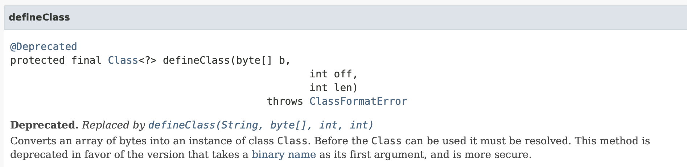
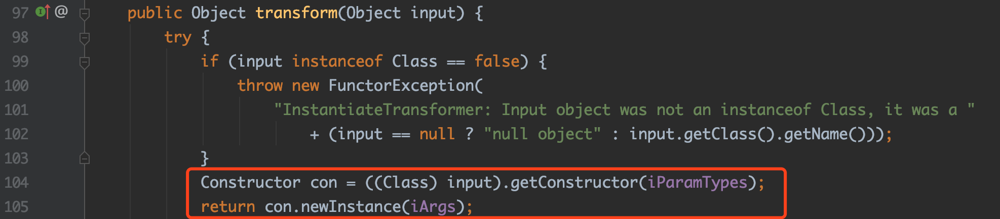
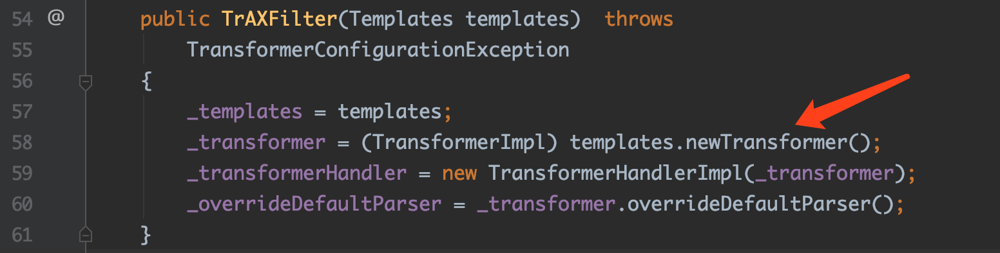
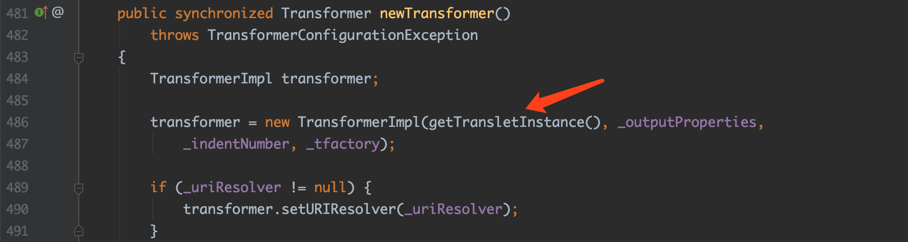
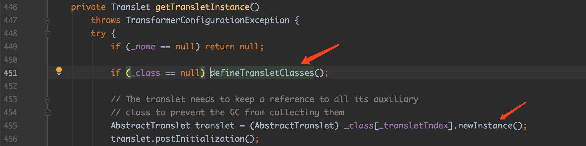
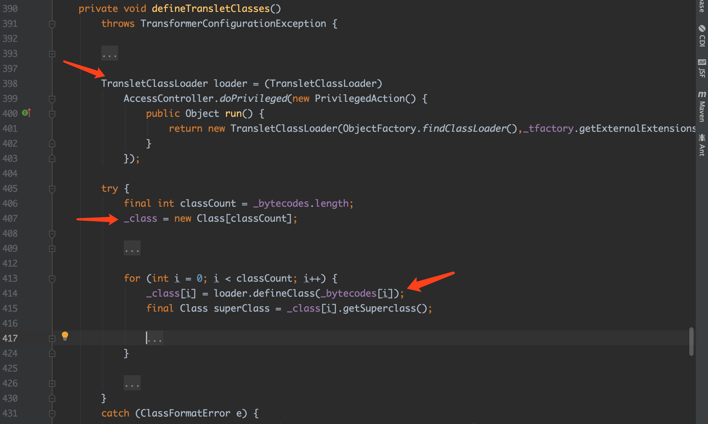
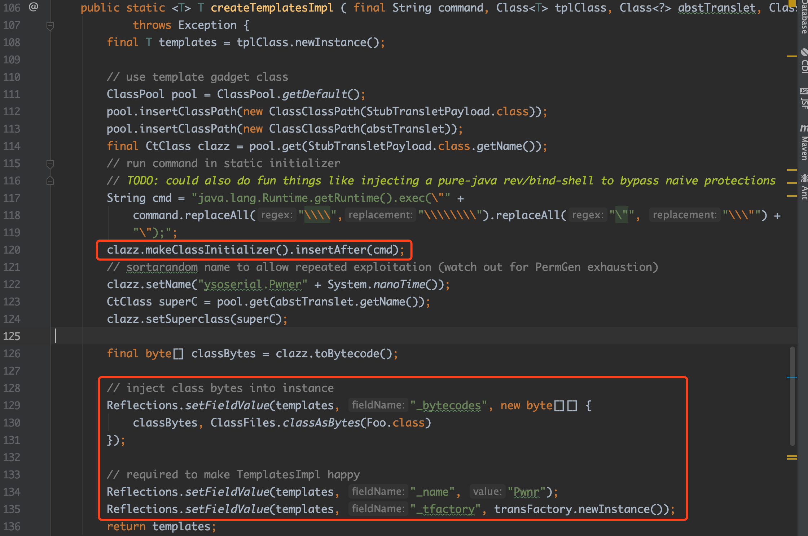
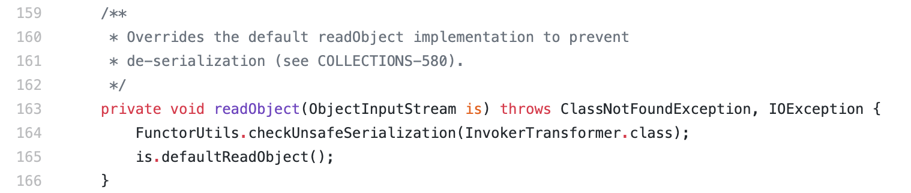
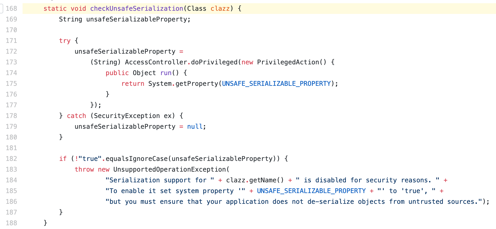

## 0x00 前言

前面分析了ysoserial的CommonsCollections1，熟悉了一点Java反序列化。本文将继续分析ysoserial的利用，今天的主角是CommonsCollections3.

<!-- more -->

## 0x01 环境准备

首先由于override的原因，环境使用的是jdk7u80。利用ysoserial生成payload，并载入调试。

```bash
java -jar ysoserial-master-30099844c6-1.jar CommonsCollections3 "open /System/Applications/Calculator.app" > commonscollections3.ser
```

## 0x02 基础知识

在分析开始前，先补充一下基础知识

```java
public class StaticBlockTest {
}
```

```java
public class Cracker {

    public static byte[] generate(){
        try {
            String code = "{java.lang.Runtime.getRuntime().exec(\"open /System/Applications/Calculator.app\");}";
            ClassPool pool = ClassPool.getDefault();
            CtClass clazz = pool.get(StaticBlockTest.class.getName());
            clazz.setName("demo");
            clazz.makeClassInitializer().insertAfter(code);
            return clazz.toBytecode();
        // ...
    }
    public static void main(String[] args) {
        byte[] clazz = generate();
        DefiningClassLoader loader = new DefiningClassLoader();
        Class cls = loader.defineClass("demo",clazz);// 从字节数组中恢复类
        try {
            cls.newInstance(); // 实例化该类时会自动调用静态块内的代码
        } 
      	// ...
    }
}
```

通过上面这个例子，我们可以获得的知识点主要为两点：

​		a. defineClass可以从byte数组中恢复一个Class

​       b. static initializer在类载入时将自动执行（静态块内的代码）

Java中动态调用的另一种方式是`defineClass`



Java提供了ClassLoader从bytes数组中还原Class的方法，defineClass函数就是完成这一过程的函数。

理论上，如果代码中使用了这种方式，且byte数据的内容可控，我们可以执行任意Java代码。为什么呢？

这里就用到了Java类的另一个特性，static block在类载入时自动执行块内的代码。我们可以通过javassist对静态块注入任意代码，该类被恢复并载入时会调用注入的代码，后文的利用链主要就是用到了这两个知识点。

## 0x03 利用链分析

### 1. 前景回顾

这里选择CommonsCollections3是因为他的前半段触发的利用链跟CommonsCollections1是一样的，所以这里只需要分析后半段命令执行的构造即可。回顾一下前半段利用链

```
sun.reflect.annotation.AnnotationInvocationHandler.readObject()
	-> memberValues.entrySet()
	-> AnnotationInvocationHandler.invoke()
	-> memberValues.get() => LazyMap.get()
	-> factory.transform() => ChainedTransformer.transform()
	-> iTransformers[].transform()
```

CommonsCollections1中ChainedTransformer.transform()会循环调用iTransformers数组里的对象的transform函数。CommonsCollections1用的是InvokerTransformer的transform，因为该函数实现了反射调用任意类的功能。那么除了使用InvokerTransformer还有没有其他的方法？答案当然是肯定的！

### 2. 新的命令执行利用链

来看一下CommonsCollections3的payloads构造

```java
Object templatesImpl = Gadgets.createTemplatesImpl(command);

// real chain for after setup
final Transformer[] transformers = new Transformer[] {
      new ConstantTransformer(TrAXFilter.class),
      new InstantiateTransformer(
            new Class[] { Templates.class },
            new Object[] { templatesImpl } )};
// 后续类似 省略
```

`ConstantTransformer`上一篇已经说过了，其`transform`会返回构造时的对象，这里就是`TrAXFilter.class`对象。

我们重点来看`InstaniateTransformer`的`transform`函数



简单来看，该函数对输入的input（这里就是TrAXFilter.class）做实例化的操作。这里看起来，其实有点像php中找对应的__constructs，在Java里我们就去找构造函数里做了危险操作的class。

来看一下`TrAXFilter`类的构造函数



这里的`templates`就是上面exp中构造的`templatesImpl`.

继续看TransformerImpl的newTransformer函数

`org.apache.xalan.internal.xsltc.trax.TemplatesImpl.java:newTransformer:481`



继续看`getTransletInstance`



再继续`defineTransletClasses`



看到这里是不是有点熟悉，没错，这里用到了0x02中的两个基础知识。`defineTransletClasses`还原出类，`getTransletInstance`进行实例化。那么我们只需要构造一个合适的`_bytecodes`即可执行任意Java代码。

下面补充一下，在构造exp时需要满足的条件：

1. 植入的`templates`为`TransformerImpl`类，从而调用后续的`newTransformer`函数
2. 植入的`templates`实例，`_name`不为`null`,`_class`为`null`
3. 植入的`templates`实例，`_bytecodes`不为`null`,`_tfactory`为`TransformerFactoryImpl`对象
4. 植入的`templates._bytecodes`数组，其最终还原的对象父类为`com.sun.org.apache.xalan.internal.xsltc.runtime.AbstractTranslet`

那么怎么才能满足这些条件呢？这里神奇的javassist又要上场啦！

来看一下ysoserial的操作



上面的代码不做省略，我们应该好好学习一下javassist的基本操作，代码可以在`Gadgets.createTemplatesImpl`找到！

这里框了两个框，第一个框是通过javassist注入静态块，静态块的内容就是我们需要执行的命令。第二个框是ysoserail框架自己封装的一个反射工具类，通过这个类我们可以动态的操作`templates`实例的类属性内容。这里主要就是在满足上述的几个条件。

这里有一点可以提一下，该利用链的作者在填充`_bytecodes`时，额外填充了一个无关的类(上图第130行)。这个类主要用于满足`_auxClasses`,让这个`getTransletInstance`函数能正常走完。

经过上面的分析，其实我们可以知道`getTransletInstance`的第408行，对`_class`做实例化时我们想要执行的代码就已经执行了。所以这里额外填充的类其实是可有可无的。

## 0x04 总结

到这里，整一个CommonsCollections3就分析结束了。

CommonsCollections3主要利用了可控的byte数组从defineClass函数中还原出恶意构造的Class。并且在后续的调用中，这个Class被注入到内存中，从而执行了注入的静态块的代码，实现了任意Java代码执行。

到这篇为止，我们已经知道了两种Java的任意代码执行的构造方式

1. 利用可控的反射机制。具体的Class、Method等均可控时，利用反射机制，可以构造出任意的类调用、类函数调用
2. 利用可控的defineClass函数的byte数组。构造恶意的Class字节码数组，常于静态块注入恶意代码

### 20191104 补充

前面的分析并没有提到3.2.2版本发生了啥事，导致了利用链的失效，这里简单提一下



3.2.2版本对InvokerTransformer增加了readObject函数，并且做了是否允许反序列化的检查，在`FunctorUtils.checkUnsafeSerialization`函数内。



这里UNSAFE_SERIALIZABLE_PROPERTY的值默认为false，如果需要为true，需要在运行时指定。

所以在使用InvokerTransformer作为反序列化利用链的一部分时，会throw一个exception。除了InvokerTransformer类外，还有CloneTransformer, ForClosure, InstantiateFactory, InstantiateTransformer, InvokerTransformer, 
PrototypeCloneFactory, PrototypeSerializationFactory, WhileClosure。所以在3.2.2版本以上，基本上利用链都已经废了。

当然，这种方法治标不治本，如果可以在这些类以外，构造一个利用链同样可以达到前面的效果。