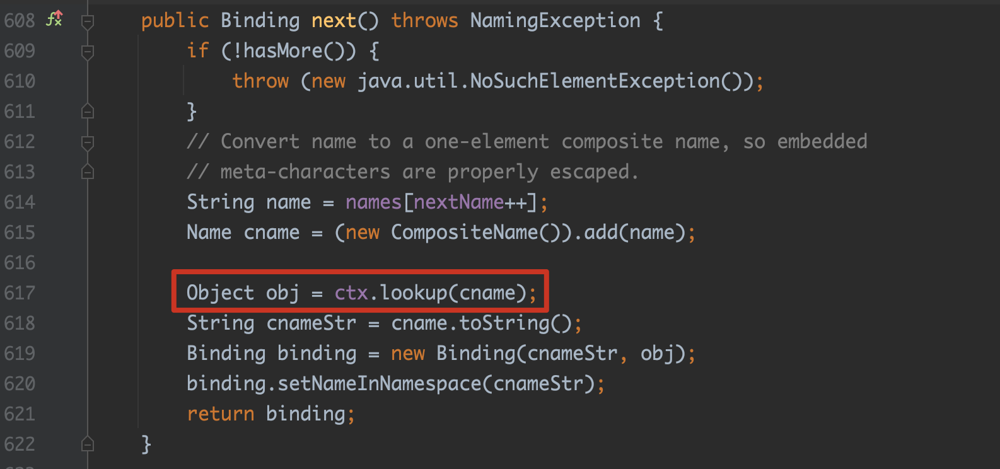
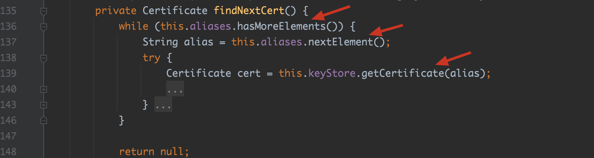
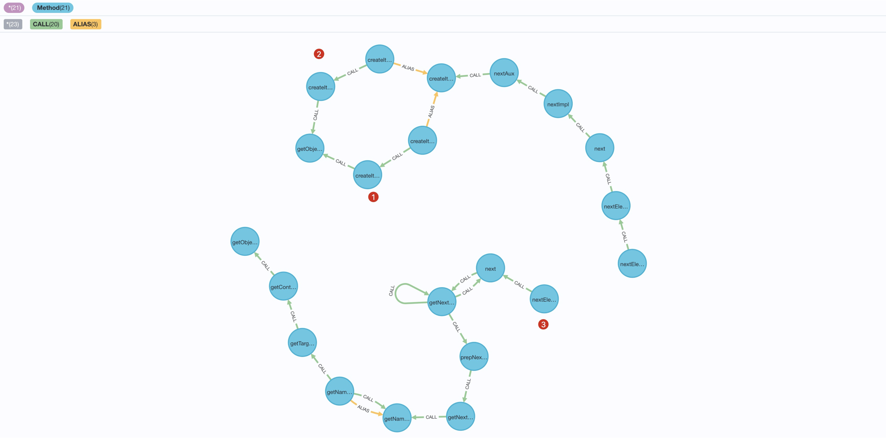
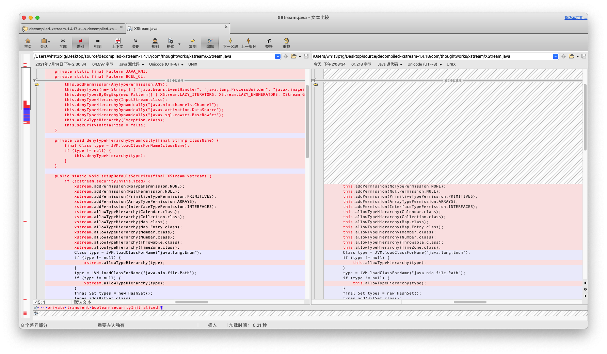
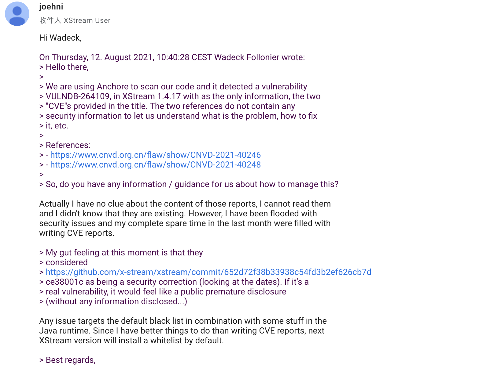

## #1 前言

之前在文章 [如何高效地挖掘 Java 反序列化利用链](https://blog.0kami.cn/2021/03/14/java-how-to-find-gadget-chains/) 中提到了我是如何高效挖掘利用链的，这其中提到了工具 [tabby](https://github.com/wh1t3p1g/tabby) 。

目前，tabby 开源也有一段时间了，这段时间里有不少小伙伴问我如何在实际环境中更好地使用它？

为此，本文将介绍我是如何利用 tabby 捡漏 XStream [CVE-2021-39147](https://x-stream.github.io/CVE-2021-39147.html) && [CVE-2021-39148](https://x-stream.github.io/CVE-2021-39148.html) 。

<!-- more -->

## #2 材料准备

跟之前那篇文章提到的一样，我们先对 JDK 生成代码属性图

```
# 生成图缓存文件
java -Xmx8g -jar build/libs/tabby-1.1.0-RELEASE.jar --isJDKOnly
# 导入Neo4j图数据
java -Xmx8g -jar build/libs/tabby-1.1.0-RELEASE.jar --isSaveOnly
```

## #3 背景介绍

XStream 自 1.4.16 版本的修复之后，有师傅在 TSRC 提交了 [CVE-2021-29505](https://x-stream.github.io/CVE-2021-29505.html) (PS: TSRC yyds)

该链跟之前我们在 1.4.15 版本时候挖的利用链都不太一样，它重新找到了一个新的触发 toString 的对象。这条链之前应该有师傅分析过了，就不细说了，这里直接贴一下调用链。

```
javax.naming.ldap.Rdn$RdnEntry#compareTo 
com.sun.org.apache.xpath.internal.objects.XString#equal 
com.sun.xml.internal.ws.api.message.Packet#toString 
com.sun.xml.internal.ws.message.saaj.SAAJMessage#copy
com.sun.xml.internal.ws.message.saaj.SAAJMessage#getAttachments
com.sun.xml.internal.ws.message.saaj.SAAJMessage$SAAJAttachmentSet#<init>
com.sun.xml.internal.messaging.saaj.soap.ver1_1.Message1_1Impl#getAttachments
com.sun.xml.internal.messaging.saaj.soap.ver1_1.Message1_1Impl#initializeAllAttachments
com.sun.xml.internal.messaging.saaj.packaging.mime.internet.MimePullMultipart#getCount
com.sun.xml.internal.messaging.saaj.packaging.mime.internet.MimePullMultipart#parse
com.sun.xml.internal.messaging.saaj.packaging.mime.internet.MimePullMultipart#parseAll
com.sun.xml.internal.org.jvnet.mimepull.MIMEMessage#getAttachments
com.sun.xml.internal.org.jvnet.mimepull.MIMEMessage#parseAll 
com.sun.xml.internal.org.jvnet.mimepull.MIMEMessage#makeProgress 
com.sun.org.apache.xml.internal.security.keys.storage.implementations.KeyStoreResolver$KeyStoreIterator#hasNext 
com.sun.org.apache.xml.internal.security.keys.storage.implementations.KeyStoreResolver$KeyStoreIterator#findNextCert
com.sun.jndi.toolkit.dir.LazySearchEnumerationImpl#nextElement
com.sun.jndi.toolkit.dir.LazySearchEnumerationImpl#findNextMatch
com.sun.jndi.rmi.registry.BindingEnumeration#next
sun.rmi.registry.RegistryImpl_Stub#lookup
```

这里接过 toString 函数的是 `com.sun.xml.internal.ws.api.message.Packet`，并且最后以 `com.sun.jndi.rmi.registry.BindingEnumeration#next` 触发 lookup 函数



这里红框框的地方 ctx 被设置为 `sun.rmi.registry.RegistryImpl_Stub` 来对外发起 RMI 连接。

这里另外说一下，其实 CVE-2021-29505 的利用链可以简化为

```
sun.rmi.registry.RegistryImpl_Stub#readObject
sun.rmi.server.UnicastRef#readExternal
# trigger rmi connect
```

有兴趣的小伙伴可以看 RMI 绕过相关的文章，除了 RegistryImpl_Stub，另外还有 [link](https://github.com/wh1t3p1g/ysomap/blob/52df82c56896aa155b7b5fe5306f50f2f1c87622/core/src/main/java/ysomap/payloads/java/rmi/RMIConnectWrapped.java#L48-L53)

回到主题，通过 29505 这条链我们可以对外发起 RMI 连接，并且他是完全绕过 16 版本的黑名单的。

为此，XStream 的官方出了 17 版本的黑名单补丁，这里来看一下 17 版本下所有的黑名单

黑名单字符对象

```java
this.denyTypes(new String[] { 
       "java.beans.EventHandler", 
       "java.lang.ProcessBuilder", 
       "javax.imageio.ImageIO$ContainsFilter", 
       "jdk.nashorn.internal.objects.NativeString", 
       "com.sun.corba.se.impl.activation.ServerTableEntry", 
       "com.sun.tools.javac.processing.JavacProcessingEnvironment$NameProcessIterator", 
       "sun.awt.datatransfer.DataTransferer$IndexOrderComparator",       
       "sun.swing.SwingLazyValue" 
});
```

黑名单正则

```java
GETTER_SETTER_REFLECTION = Pattern.compile(".*\\$GetterSetterReflection");
PRIVILEGED_GETTER = Pattern.compile(".*\\$PrivilegedGetter");
LAZY_ENUMERATORS = Pattern.compile(".*\\.Lazy(?:Search)?Enumeration.*");
LAZY_ITERATORS = Pattern.compile(".*\\$LazyIterator");
JAXWS_ITERATORS = Pattern.compile(".*\\$ServiceNameIterator");
JAVAFX_OBSERVABLE_LIST__ = Pattern.compile("javafx\\.collections\\.ObservableList\\$.*");
JAVAX_CRYPTO = Pattern.compile("javax\\.crypto\\..*");
JAVA_RMI = Pattern.compile("(?:java|sun)\\.rmi\\..*");
BCEL_CL = Pattern.compile(".*\\.bcel\\..*\\.util\\.ClassLoader");
```

黑名单继承对象

```java
this.denyTypeHierarchy(InputStream.class);
this.denyTypeHierarchyDynamically("java.nio.channels.Channel");
this.denyTypeHierarchyDynamically("javax.activation.DataSource");
this.denyTypeHierarchyDynamically("javax.sql.rowset.BaseRowSet");
```

从上面列举的黑名单，我们可以知道 17 版本的补丁对 29505 这条链的几个对象进行了黑名单处理。

```java
Pattern.compile("(?:java|sun)\\.rmi\\..*");  
==拉黑==>  sun.rmi.registry.RegistryImpl_Stub, sun.rmi.server.UnicastRef

Pattern.compile(".*\\.Lazy(?:Search)?Enumeration.*");
==拉黑==>  com.sun.jndi.toolkit.dir.LazySearchEnumerationImpl

```

到这里我们可以发现，对于 29505 这条利用链，如下部分利用链仍然是可用的

```
javax.naming.ldap.Rdn$RdnEntry#compareTo 
com.sun.org.apache.xpath.internal.objects.XString#equal 
com.sun.xml.internal.ws.api.message.Packet#toString 
com.sun.xml.internal.ws.message.saaj.SAAJMessage#copy
com.sun.xml.internal.ws.message.saaj.SAAJMessage#getAttachments
com.sun.xml.internal.ws.message.saaj.SAAJMessage$SAAJAttachmentSet#<init>
com.sun.xml.internal.messaging.saaj.soap.ver1_1.Message1_1Impl#getAttachments
com.sun.xml.internal.messaging.saaj.soap.ver1_1.Message1_1Impl#initializeAllAttachments
com.sun.xml.internal.messaging.saaj.packaging.mime.internet.MimePullMultipart#getCount
com.sun.xml.internal.messaging.saaj.packaging.mime.internet.MimePullMultipart#parse
com.sun.xml.internal.messaging.saaj.packaging.mime.internet.MimePullMultipart#parseAll
com.sun.xml.internal.org.jvnet.mimepull.MIMEMessage#getAttachments
com.sun.xml.internal.org.jvnet.mimepull.MIMEMessage#parseAll 
com.sun.xml.internal.org.jvnet.mimepull.MIMEMessage#makeProgress 
com.sun.org.apache.xml.internal.security.keys.storage.implementations.KeyStoreResolver$KeyStoreIterator#hasNext 
com.sun.org.apache.xml.internal.security.keys.storage.implementations.KeyStoreResolver$KeyStoreIterator#findNextCert
```

如果能找到从 `findNextCert` 函数开始的其他端点，我们仍然能对 17 版本的补丁进行绕过。

答案当然是肯定的，必然存在一些其他的端点，但是人工去挖掘会特别耗时，那么为了高效捡漏，我们当然不能人工去做这件事。这里我们的 tabby 就要登场了。

## #4 高效捡漏

这里我们先来分析一下 `findNextCert` 函数



从这里看，我们可以利用类属性 aliases 和 keyStore 来进行后续利用链的挖掘。

这里以 aliases 举例，之前 29505 利用链就是依靠 `LazySearchEnumerationImpl#nextElement` 开始找到的 rmi 的 sink 函数。那么，我们现在重新找一个新的，就需要满足如下条件：

- 对象实现了 `java.util.Enumeration` 接口
- 从该对象的 nextElement 函数开始，最终能到达一个触发恶意行为的 sink 函数
- 从 nextElement 函数开始到 sink 函数，路径上不能出现前面黑名单涉及的对象

如果能满足上述条件，那么我们就挖到了能绕过 17 版本补丁的新利用链。接下来的工作就交给 tabby 来做了。

首先，我们需要根据上述的条件，描述出具体的查询语句。先来限制一下 source 函数

```cypher
match (source:Method {NAME:"nextElement"})
                    <-[:HAS]-(cls:Class)-[:INTERFACE|EXTENDS*]
                    ->(cls1:Class {NAME:"java.util.Enumeration"})
match (source)-[:CALL]->(m1:Method)
```

source 函数为 nextElement，并且实现了 `java.util.Enumeration` 接口

再来限制 sink 函数

```cypher
match (sink:Method {IS_SINK:true, VUL:"JNDI"})
```

这里就限制当前 sink 函数最终能达成 JNDI 注入的效果。

最后，我们再来限制一下路径上不能出现的黑名单对象

```cypher
call apoc.algo.allSimplePaths(sink, m1, "<CALL|ALIAS", 8) yield path 
where none(n in nodes(path) where n.CLASSNAME in ["java.beans.EventHandler","java.lang.ProcessBuilder",
"javax.imageio.ImageIO$ContainsFilter","jdk.nashorn.internal.objects.NativeString",
"com.sun.corba.se.impl.activation.ServerTableEntry",
"com.sun.tools.javac.processing.JavacProcessingEnvironment$NameProcessIterator",
"sun.awt.datatransfer.DataTransferer$IndexOrderComparator","sun.swing.SwingLazyValue",
"com.sun.jndi.toolkit.dir.LazySearchEnumerationImpl","sun.rmi.registry.RegistryImpl_Stub",
 
"com.sun.jndi.dns.BindingEnumeration","com.sun.jndi.cosnaming.CNBindingEnumeration","com.sun.jndi.toolkit.dir.HierMemDirCtx$FlatBindings","com.sun.jndi.ldap.LdapReferralException"])
return source,path limit 50
```

这里第 9 行上的黑名单是后续人工排除后添加的（不可行或构造过于麻烦）。

把上面的 3 个部分合起来后查询最终能得到如下 3 条利用链。



分别是一下对象

- com.sun.jndi.ldap.LdapSearchEnumeration  对应 CVE-2021-39147
- com.sun.jndi.ldap.LdapBindingEnumeration 对应 CVE-2021-39145 （CVE-2021-39151 用的也是这个）
- com.sun.jndi.toolkit.dir.ContextEnumerator 对应 CVE-2021-39148

他们分别最终将调用 sink 函数 `NamingManager.getContext` 和 `DirectoryManager.getObjectInstance`

这两个 sink 函数是 JNDI 处理 Reference 的函数，通过这两个函数可以在特定 JDK 版本下载入外部的任意代码，也可以在 tomcat 下执行 el 表达式，具体可以看 JNDI 关于 Reference 的知识。

## #5 补丁修复

XStream 1.4.18 版本开始将默认开启白名单模式，只允许几个基础类型的进行还原。



但是这里想不明白的是为何将之前的黑名单处理直接删除了，这意味着未来 XStream 的安全性将依靠开发者对于反序列化风险的认识。

此外，后续版本绕过默认白名单还是存在可能性的，但是估计没办法像现在这样能造成那么大的危害了吧。

## #6 总结

本文讲述了我是如何通过 tabby 来捡漏利用链的，这里欢迎师傅们给 tabby 提 pr 或 issue。

另外，这里还有一件趣事，由于国内过于积极提交利用链，XStream 官方无奈之下默认开启白名单的方式来解决后续可能的绕过。嗯，手动狗头。


