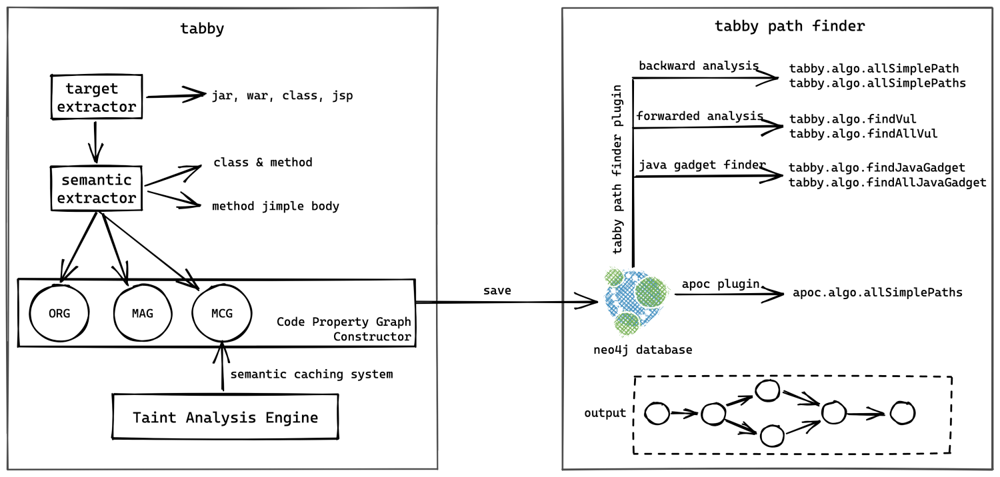
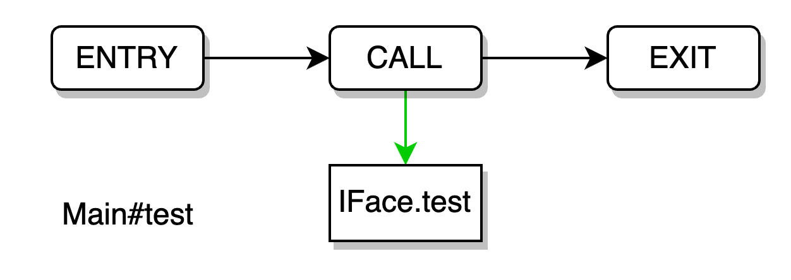
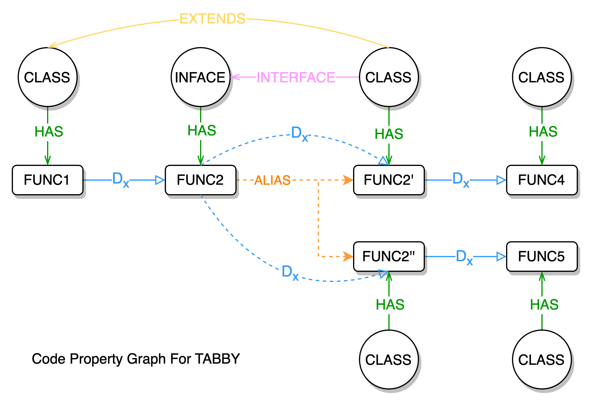
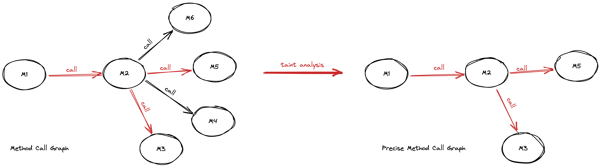
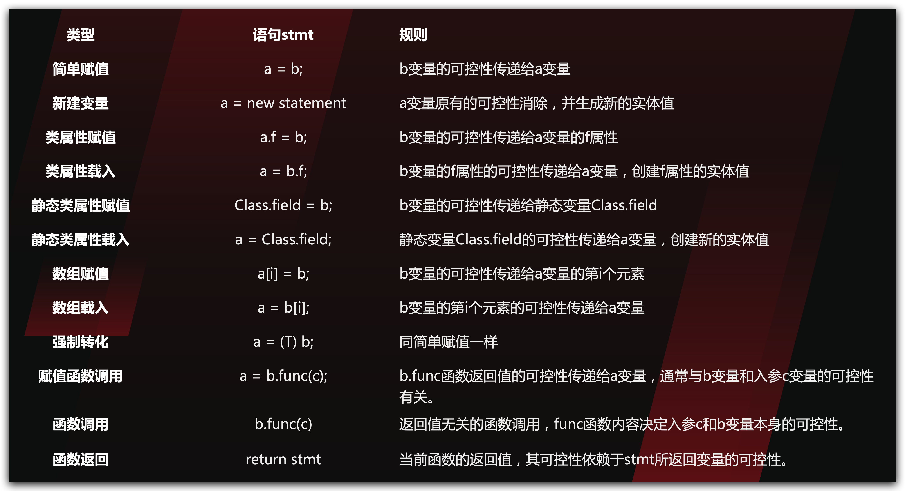
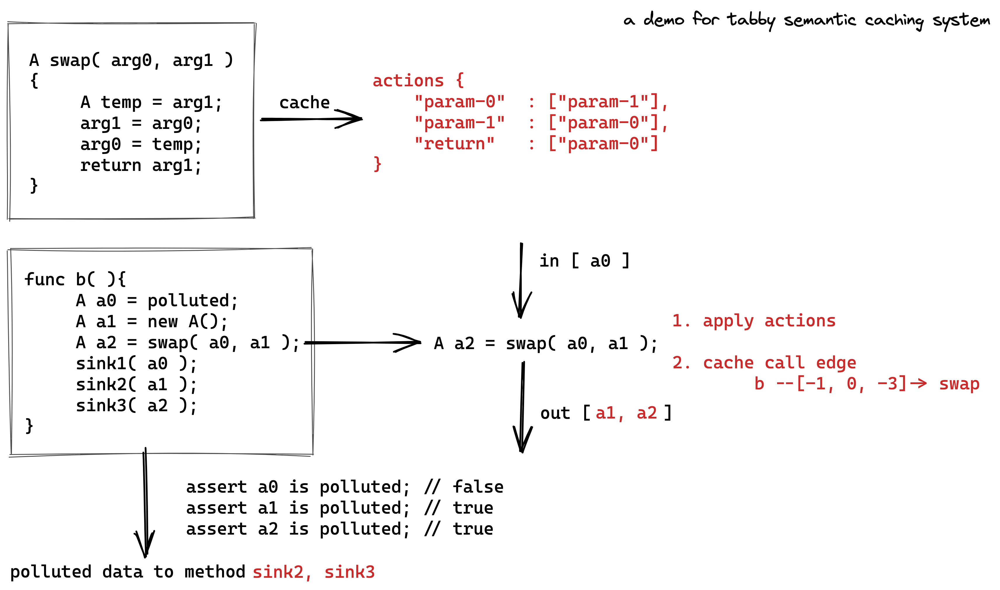
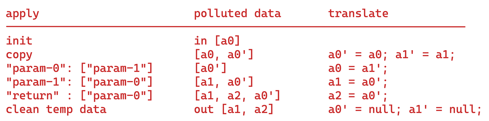
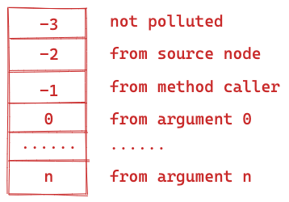
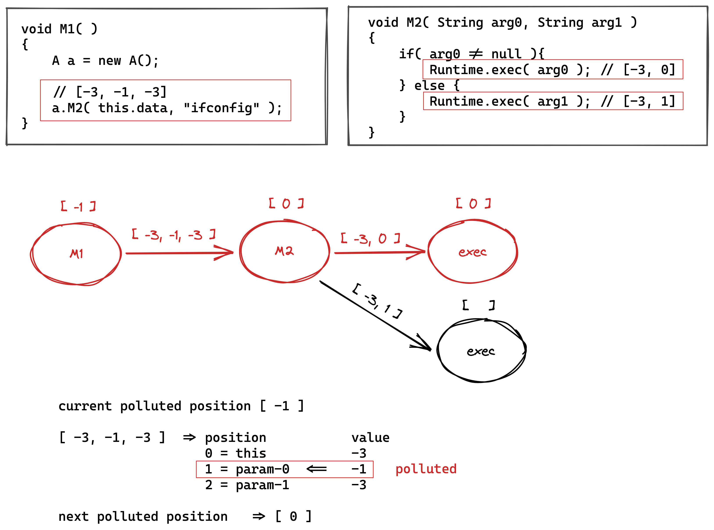
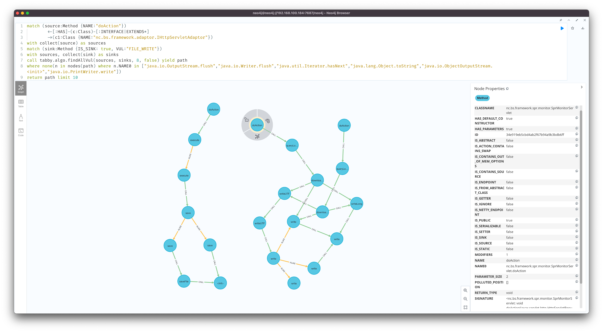

## #0 前言
应用程序分析技术挖掘应用漏洞一直以来都是学术界和工业界的研究重点之一。从最初的正则匹配到最近的代码属性图挖掘方案，国内外有很多来自不同阶段的安全工具或商业产品来发掘程序代码的安全问题。在 Java 语言方面，业界已经有了不少出色的产品，如 CodeQL 等，但是，多数产品考虑的角度是从甲方视角或开源视角出发的，也就是产品的输入大部分是以源码为主。然而，我们安全研究人员更多面对地是编译后的项目，比如编译后的 WAR、第三方依赖 JAR 等形式。对于此类形式目标的漏洞挖掘，当前存在的审计产品或多或少都有一些限制，比如最近几年很火的 CodeQL 就无法直接处理此类形式的目标代码。当前，安全研究人员大多以人工或一些辅助工具来完成此类形式项目的漏洞挖掘。很明显，这种方式审计效率是非常低的，而且，审计结果也很容易遗漏。为此，需要一款能解决此类问题的工具。

## #1 方案介绍
为了更好地辅助安全研究人员进行漏洞挖掘，我设计了基于代码属性图的自动化漏洞挖掘方案，并开发了 tabby 项目用于解决此类问题，旨在更简单更全面地挖掘更多的安全问题。方案通过整合代码语义信息和图数据库相关技术，使得单一项目（编译后的目标文件）分析后可多次重复分析，而无需重复进行繁重的程序语义分析。这种方式带来了分析成本上的优势。并且图数据库自身所擅长的路径检索能力也能充分发挥在漏洞调用链路的挖掘上。

方案将传统的程序分析流程拆分成了两个阶段，包括代码属性图生成阶段和漏洞发现阶段。由代码属性图生成阶段生成的带污点信息的代码属性图将作为漏洞发现阶段的基础，用于动态查询分析具体漏洞细节。
从开发实现上看，主要为 tabby 核心项目和用于跟踪数据流的 neo4j 扩展 tabby path finder，如下图所示：


接下来，将详细介绍我们是怎么设计和实现这个方案的。

### 1. 针对面向对象语言的代码属性图实现方案

首先，最基础的是如何设计一个能在图数据库中直接进行代码分析的图结构。为此，我们调研了一些学术界的代码属性图实现方案，如下几篇重要的论文
```
[1] Martin M, Livshits B, Lam M S. Finding application errors and security flaws using PQL: a program query language[J]. Acm Sigplan Notices, 2005, 40(10): 365-383.
[2] Yamaguchi F, Golde N, Arp D, et al. Modeling and discovering vulnerabilities with code property graphs[C]//2014 IEEE Symposium on Security and Privacy. IEEE, 2014: 590-604.
[3] Backes M, Rieck K, Skoruppa M, et al. Efficient and flexible discovery of php application vulnerabilities[C]//2017 IEEE european symposium on security and privacy (EuroS&P). IEEE, 2017: 334-349.
```
上面三篇论文在代码属性图的设计上做了一些尝试，但是他们主要针对的对象是面向过程语言，这其中不涉及解决一些面向对象语言的特性，比如多态特性。举个实际例子
```java
interface IFace {
    void test();
}
class A implements IFace {
    public void test(){}
}
class B implements IFace {
    public void test(){}
}

class Main {

    public static void test(IFace iFace){
        iFace.test();
    }

    public static void main(String[] args) {
        IFace a = new A();
        test(a);
        IFace b = new B();
        test(b);
    }
}
```
如果采用论文中所设计的代码属性图，简化分析 `Main#test` 函数，我们可以得到这样一个指向关系

在面向过程语言中，这样分析是没有问题的，因为 `IFace` 对象的指向是固定的，而在面向对象语言中，由于 IFace 是一个接口 interface 类型，它实际的代码实现是空的，我们需要找到对应的具体实现该接口的对象才能进行相应分析。比如上述的代码表示，我们需要从分析过程中，推算出当前执行的 `iFace.test()` 可能是 `A.test` 或 `B.test`。很明显，此类代码属性图是不符合分析面向对象语言的。
此外，上述论文中的代码属性图都保留了 AST、CFG，但是，实际上如果当前函数内容和分析算法均不发生改变，不管是第一次分析也好，还是第 n 次分析也好，其分析结果是固定的，那么保留 AST、CFG 结构除了更好的展示代码结构外，并没有起到多大的用处。当然，假设分析算法也同时开放给用户的情况另算。
为了能契合面向对象语言，我们重新设计了面向对象语言的代码属性图实现方案。我们的方案摒弃了多余的数据结构（AST、CFG），新增了针对面向对象语言的特殊数据结构。

该代码属性图实现方案由类关系图 ORG、函数别名图 MAG、函数调用图 MCG 3 种子图组合而成。图中共有 Class 和 Method 两种实体节点，5 种关系边，下文将详细叙述这三种子图构成及作用。
#### 类关系图 Object Relation Graph
类关系图用于描述对象自身的相关语义信息和对象之间的语义关系，共三种关系
- 类与函数之间的归属关系 HAS 边
- 类与接口之间的实现关系 INTERFACE 边
- 类与类之间的继承关系 EXTENDS 边

通过串联类与类、类与函数之间的关系边，我们可以得到一颗颗独立对象函数继承树。
利用 Neo4j 的查询语法，我们可以动态查询符合条件的类和函数。
#### 函数别名图 Method Alias Graph
在前文中，提到了三篇论文设计的代码属性图没有考虑面向对象语言，导致在图中函数调用之间是相互割裂的。还是用上文提到的这个例子，我们没有办法在图数据库中直接找到一个从 `Main#test` 函数到 `A#test` 或 `B#test` 的一条通路，也就意味着我们不能通过类似 Neo4j 的查询语法来直接完成函数调用链路的输出。这显然是不符合我们的实际需求的，为此，我们设计了函数别名图来解决这个问题。
函数别名图描述了某一函数所有具体实现的语义图，主要用于面向对象语言多态特性在图数据库中的表达。该图由描述函数与函数之间的别名关系 ALIAS 边连接而成，类似 ORG 图，函数别名图也会产生一颗颗独立的函数树，树顶为 interface 或顶层类型，树枝为当前树顶函数的具体实现。

以上文中的代码为例，通过 MAG 图，我们可以找到一条从 `Main#main` 到 `A#test` 或 `B#test` 的函数调用通路。有了通路之后，我们就可以通过 Neo4j 的查询语法来查询此类函数调用路径。而且，MAG 图可以使得程序分析过程中的函数枚举实现下方到图数据库中进行，在一定程度上，可以缓解程序分析过程中的路径爆炸问题，详见 ppt 12。
#### 函数调用图 Method Call Graph
函数调用图主要用于描述函数与函数之间的调用关系图，利用该有向的调用关系可以查询出一条有效的函数调用路径。同时，我们也保留了 PDG 图，在 CALL 边上保留了污点信息用于后续的过程间数据流分析。更近一步的是，通过污点分析，我们可以保留受污染的调用边，减少后续图数据库中无用边的枚举递归查找。


通过组合上述三个子图，我们最终可以达到 2 个效果
1. 直接利用 Neo4j 的查询语法即可完成有效路径枚举工作
2. 可以将“有效”路径的判别下放到图数据库中完成（即过程间数据流分析）

### 2. 结合图数据库的污点分析引擎
接下来，我们来看看如何在图数据库中来判定“有效”路径
为了能更好的结合图数据库的技术优势，我们重新编排了程序分析的整体流程，简单来看，将其分为化整为零和化零为整两个部分。
化整为零部分着重于生成 PDG（program data graph），使得每一条函数调用边上都有入参等变量的污点信息。
化零为整部分着重于利用 PDG 和图数据库的路径检索能力，重建函数调用链路。重建过程以污点信息动态推算，边剪枝无效调用边重建链路，在一定程度上缓解了路径爆炸问题。
#### 化整为零
化整为零部分涉及了单函数过程内分析算法和跨函数过程间分析算法。
单函数过程内分析算法的实现以静态分析框架 SOOT 作为基础，在 SOOT 转化的 Jimple 语法中进行相应的指针分析。此处，依据 Java 的语法规则，我们可以总结出 12 种污点流转规则

关于过程内分析细节，在 ppt 15 中，给了一个动态的分析案例，在此就不在累述了。

我们重点来看一下过程间分析算法。在程序分析技术的发展过程中，有很多用于加快分析速度的方法。我们采用了基于摘要的过程间分析算法，也就是每分析完一个函数内容后生成相应的语义缓存，该缓存可用于描述经过调用该函数后函数调用者、函数入参、函数返回值的相关语义信息。利用缓存信息可一定程度上避免程序分析过程中的重复计算问题。

我们站在前人的肩膀上设计了 tabby 的语义缓存系统。从 Java 语法的角度，我们可以知道函数运行完可能会对函数调用者和函数入参变量产生影响。为此，我们需要在函数运行完最后的语句后，整理出当前函数调用者和函数入参所发生的变化。同时，如果当前函数有返回值，还需要记录该返回值同函数调用者以及函数入参之间的关系，使得污点能通过返回值进一步传递。有了这些信息后，我们主要关注点可以放在函数调用者、函数入参列表以及函数返回值上，将所发生的语义变化抽象成一语义摘要供后续函数调用分析使用。

以下图代码为例，我们来看一下 tabby 的语义缓存系统实现

人工分析 swap 函数后，我们可以知道 arg0 和 arg1 进行了交换，返回值同 arg0 相关。
那么，我们需要用一定的规则来形成语义缓存结构。
1. 定义污点实体表示
由于污点关系逃不出函数调用者、函数入参和函数返回值，所以我们在关键字上只需要定义 3 种：`this`、`param-n`、`return`，其中 `param-n` n 为 0～n 范围内的自然数，数字指代入参位置信息。
2. 定义污点实体特殊表示
除了对变量本身的表示，我们还需要考虑变量属性、变量数组等特殊表示，用 `<f>` 指代类属性；用 `<a>` 指代变量数组；`<s>` 指代仅清除并继承右值污点信息但不改变变量指向关系；`<m>` 指代不清除原有污点信息，同时继承右值污点信息，但不改变变量指向关系。
举几个实际例子，`this<f>name : param-0` 表示应处理当前函数调用者的类属性 name 为第一个函数入参的内容；`this<a> : param-0` 表示当前函数调用者为数组类型，需将第一个函数入参放入函数调用者的数组种。
利用上面两个定义，我们可以将当前 swap 函数的语义缓存信息总结为
```json
actions {
    "param-0" : ["param-1"],
    "param-1" : ["param-0"],
    "return"  : ["param-0"]
}
```
有了这样一个语义缓存结构之后，我们需要将这一缓存信息应用到调用函数的分析中，也就是例子中 b 函数的分析。
语义缓存的利用可以分为 3 个步骤
1. 初始化并复制所有涉及的变量信息，包括函数调用者、函数入参变量列表
2. 根据语义缓存做污点赋值操作
3. 清楚临时变量
以上述 b 函数的分析为例，可以将其应用过程转换为下表的流程

此外，除了形成函数本身的语义摘要信息外，我们还需要同时生成边上的污点数据缓存，也就是 PDG 的生成。这部分主要标识当前函数调用的各个变量同当前函数的函数调用者、函数入参之间的联系，以一整型数组表示。
数组位置信息指代当前调用变量的位置信息，数组数值信息指代当前位置上的变量的污点信息。
数值信息规则如下表所示

以 b 函数调用 swap 为例，假设变量 a0 来源于参数 0，那么 `A a2 = swap(a0, a1);` 转化的污点数组为 `[-1,0, -3]`，这里 swap 的调用者为隐含变量，即 `this` 为函数调用者。

做个小结，化整为零部分主要内容为污点分析，并生成语义缓存。函数本身的语义缓存主要用于分析过程中缓解重复计算的问题；调用边上的语义缓存用于后续化零为整的动态数据流分析，即 PDG
#### 化零为整
有了相关的语义缓存信息之后，我们就可以通过编写 neo4j 的扩展来实现动态自定义的污点数据流分析，来看一个实际的例子

首先，人工分析一下 M1 函数和 M2 函数，可以知道的是 M2 函数存在危险函数 `Runtime.exec`，并且一个来自于参数 0，一个来源于参数 1。回溯到 M1 的代码中，我们可以知道传入 M2 的参数 0 为受污染的变量，参数 1 为固定字符串，不受污染。那么，经过人工分析，实际可以得到上面标红的函数调用路径是存在漏洞的。那么，从污点数组中进行推算该如何进行呢？
以 `M1-[-3,-1,-3]->M2` 这个节点为例
1. M1 函数有基础的污点信息 `[-1]`，指代当前跟函数调用者本身有关的都是受污染的
2. `a.M2(this.data, "ifconfig")` 的边上污点信息为 `[-3,-1,-3]`
3. 利用 1 和 2 的两个数组，推得 M2 的基础污点信息为 `[0]`，表示传入到 M2 函数的跟入参 0 相关的变量都是受污染的
依次类推，可以得出第一个 `exec` 函数的基础污点信息为 `[0]`，表示当前调用 `exec` 函数的第一个参数是可控的。我们都知道如果 `exec` 函数的第一个参数是可控的话，当前函数调用链路就是有问题的，可以导致任意命令注入。
而第二个 `exec` 函数的调用，在边信息 `[-3,1]` 中找不到 M2 的 `[0]`，则得不出当前 exec 的基础污点信息，所以当前的调用路径是不存在命令注入安全问题的。

通过上述例子的推算过程，我们可以编写 neo4j 的污点推算扩展，通过该扩展，我们可以直接通过自定义函数在图数据库上进行动态的污点数据流分析，挖掘存在安全问题的函数调用链路。

最终，通过这两个阶段的组合，我们可以直接通过 neo4j 的查询语法来进行漏洞挖掘。

## #2 漏洞挖掘案例
截止目前，我们已经使用 tabby 挖掘到了 60+ 0day 漏洞和 8 个 CVE。本节将分享一个实际的 web 漏洞挖掘案例，其余案例可以直接看文末的 ppt。

首先，tabby 对常见的 web 端点进行了识别，可以直接用 `IS_ENDPOINT` 属性来表示 source 函数。此处的例子比较特殊，我们需要对框架的特殊 source 进行 neo4j 语句上的描述
```cypher
match (source:Method {NAME:"doAction"})<-[:HAS]-(c:Class)-[:INTERFACE|EXTENDS*]->(c1:Class {NAME:"nc.bs.framework.adaptor.IHttpServletAdaptor"})
```
描述当前 source 的函数名为 `doAction`，且当前 source 的归属类实现了 `IHttpServletAdaptor` 接口

其次，tabby 内置了一些常见的 sink 函数，使用 `VUL` 属性来区分
```cypher
match (sink:Method {IS_SINK: true, VUL: "FILE_WRITE"})
```
描述查找文件上传相关的危险函数

最后，我们利用 tabby path finder 提供的具备污点分析的扩展函数进行漏洞利用链挖掘
```cypher
call tabby.algo.findAllVul(sources, sinks, 8, false) yield path
return path limit 1
```
通过组合上述查询语句，最终可以查询出一条有效的存在漏洞的函数调用链路。


上述例子是利用 tabby 最简单的一种应用方式，还有更多的使用方法等着你来探索 XD

## #3 总结

随着技术的发展，程序分析技术和图数据库的结合在自动化漏洞挖掘的应用上变成了一种趋势。最近几年很火的 CodeQL 也是基于这种思路开发的。本文所提及的实践仅为一种粗浅的尝试，主要介绍了 tabby 的两个重要部分的设计和实现思路。欢迎有兴趣的同学来一起交流和实践 XD

另外，此文的另一个目的是作为 KCON 2022 议题 [《 tabby: java code review like a pro 》](https://github.com/knownsec/KCon/blob/master/2022/tabby%20java%20code%20review%20like%20a%20pro%E3%80%90KCon2022%E3%80%91.pdf) 的一个补充，从文章的方式解释了 ppt 中不太清晰的点。如果你还有其他的疑问，非常欢迎私我交流 XD
